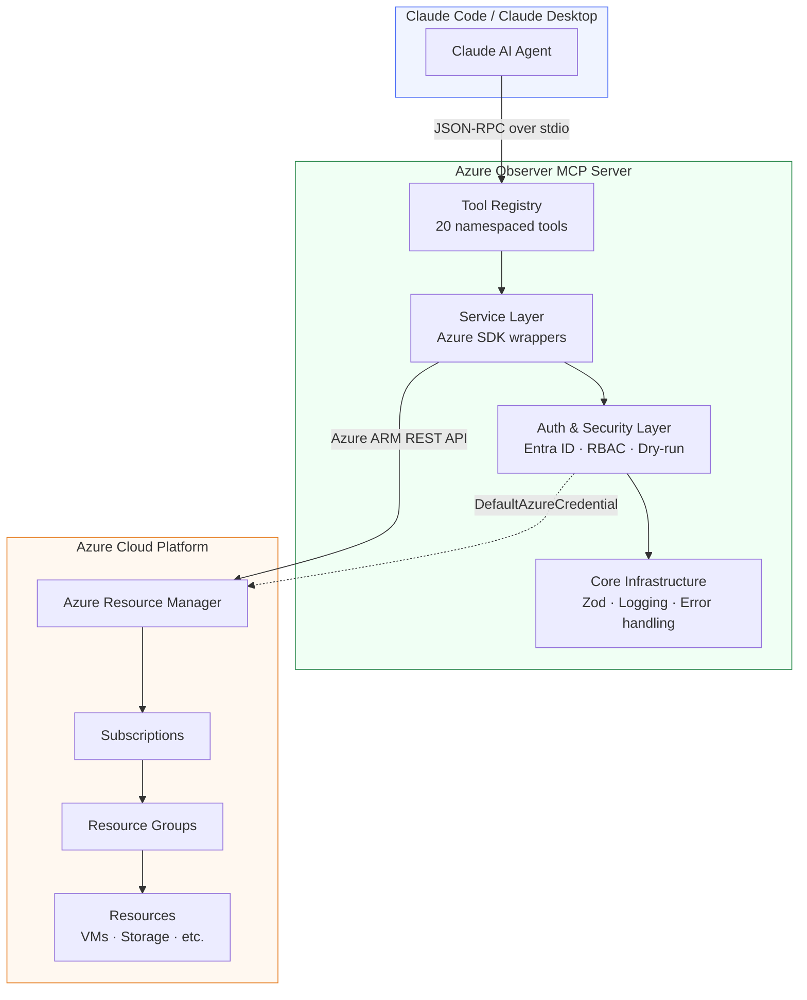
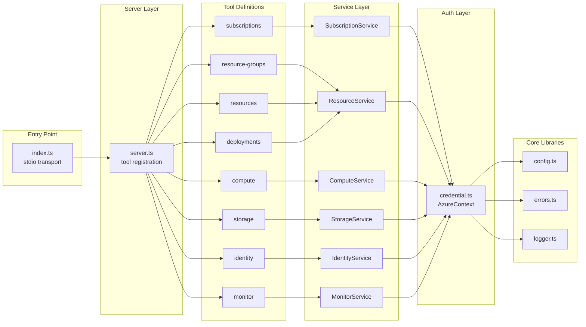
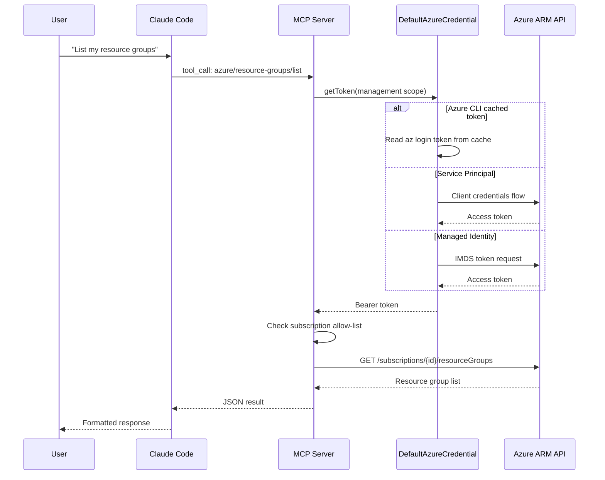
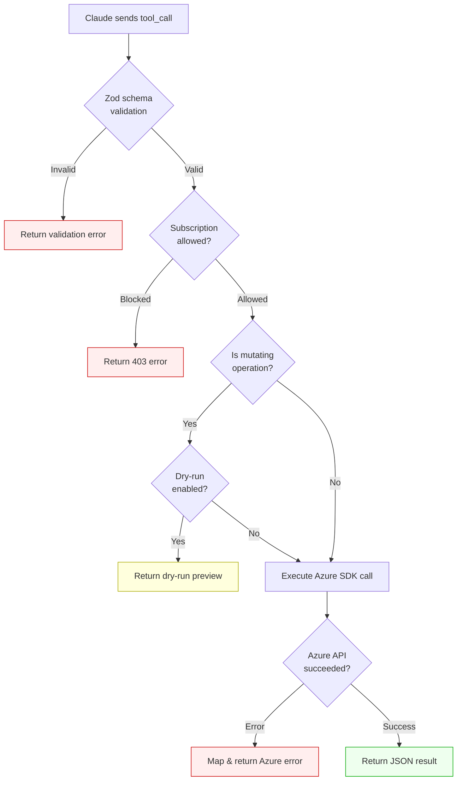
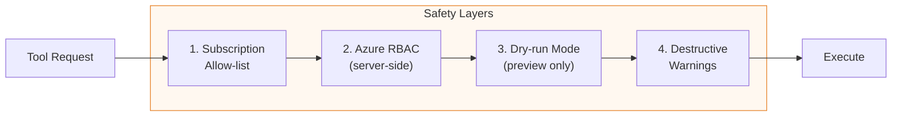
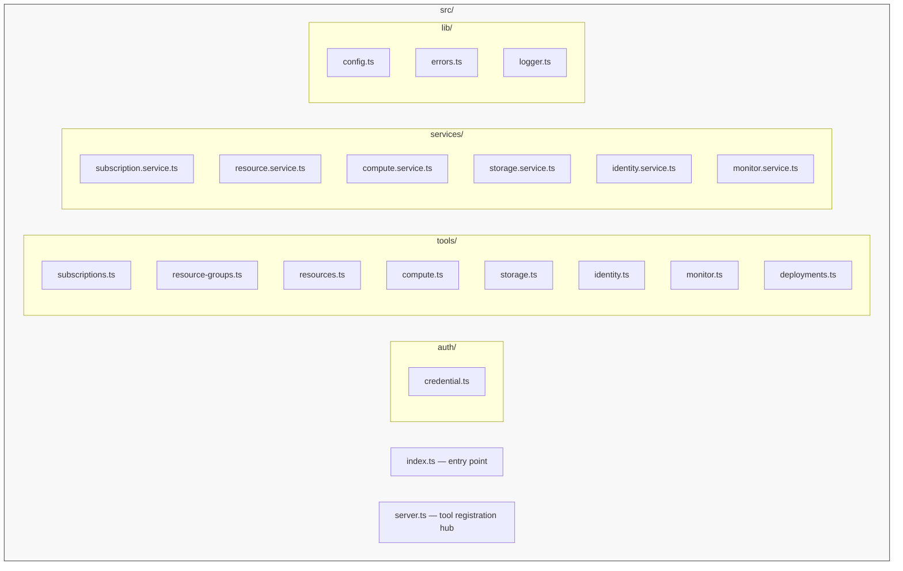
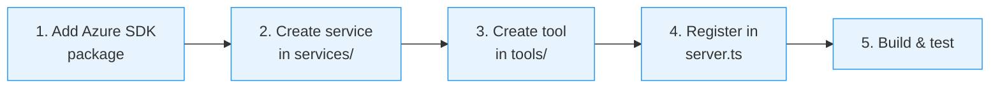
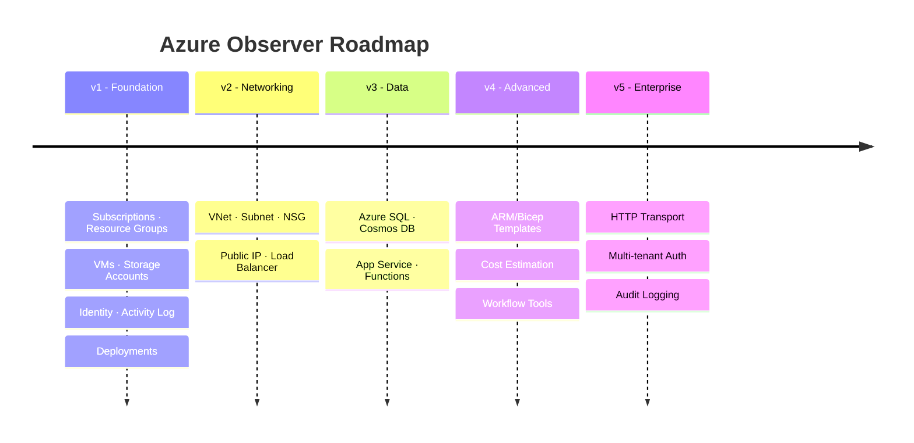

# Azure Observer MCP Server — Solution Architecture

## Overview

Azure Observer is a **Model Context Protocol (MCP) server** that enables Claude Code to provision, observe, and control Azure cloud resources through a secure, structured interface. It authenticates via **Azure Entra ID** and exposes namespaced tools for managing Azure infrastructure.

## High-Level Architecture



## Internal Component Architecture



## Design Decisions

| Decision | Choice | Rationale |
|----------|--------|-----------|
| Language | TypeScript | Official MCP SDK, type safety, Zod integration |
| Transport | stdio | Native Claude Code integration, zero infra overhead |
| Azure Auth | `DefaultAzureCredential` | Chains az CLI → env vars → managed identity seamlessly |
| Tool Design | Primitive-first | Simple, composable; Claude can chain them for workflows |
| Validation | Zod | Runtime type checking on all tool inputs/outputs |
| Logging | pino (stderr) | Fast structured JSON logs, doesn't interfere with stdio |
| Build | tsup | Fast, zero-config TypeScript bundling |
| Safety | Dry-run + allow-list | Prevents accidental provisioning/deletion |

## Authentication Flow



**Supported credential sources** (in priority order):
1. Environment variables (`AZURE_CLIENT_ID`, `AZURE_CLIENT_SECRET`, `AZURE_TENANT_ID`)
2. Azure CLI (`az login`)
3. Managed Identity (when running in Azure)

**Optional scoping**: Set `AZURE_ALLOWED_SUBSCRIPTIONS` to restrict which subscriptions the server can access.

## Tool Naming Convention

Tools use a `azure/{service}/{action}` namespace pattern:

- **Consistent**: All tools start with `azure/`
- **Discoverable**: Claude can infer related tools from the namespace
- **Extensible**: New services slot in without naming conflicts

## Tool Request Lifecycle



## v1 Tool Inventory

### Foundation
| Tool | Description | Mutating |
|------|-------------|----------|
| `azure/subscriptions/list` | List accessible subscriptions | No |
| `azure/resource-groups/list` | List resource groups in a subscription | No |
| `azure/resource-groups/create` | Create a resource group | Yes |
| `azure/resource-groups/delete` | Delete a resource group | Yes (destructive) |
| `azure/resources/list` | List resources in a resource group | No |
| `azure/resources/get` | Get resource details by ID | No |

### Compute
| Tool | Description | Mutating |
|------|-------------|----------|
| `azure/compute/vm/list` | List VMs in a resource group | No |
| `azure/compute/vm/get` | Get VM details and status | No |
| `azure/compute/vm/start` | Start a stopped VM | Yes |
| `azure/compute/vm/stop` | Stop (deallocate) a running VM | Yes |
| `azure/compute/vm/delete` | Delete a VM | Yes (destructive) |

### Storage
| Tool | Description | Mutating |
|------|-------------|----------|
| `azure/storage/account/list` | List storage accounts | No |
| `azure/storage/account/get` | Get storage account details | No |
| `azure/storage/account/create` | Create a storage account | Yes |

### Identity & Monitoring
| Tool | Description | Mutating |
|------|-------------|----------|
| `azure/identity/whoami` | Show authenticated identity and permissions | No |
| `azure/monitor/activity-log` | Query recent activity log entries | No |
| `azure/deployments/list` | List deployments in a resource group | No |
| `azure/deployments/get` | Get deployment status and details | No |

## Safety Guardrails



1. **Dry-run mode**: Set `AZURE_DRY_RUN=true` to make all mutating tools return what *would* happen without executing.
2. **Subscription allow-list**: Set `AZURE_ALLOWED_SUBSCRIPTIONS` (comma-separated IDs) to restrict access.
3. **Azure RBAC**: The server inherits the authenticated user's Azure permissions — it cannot exceed them.
4. **Destructive operation warnings**: Delete tools return explicit warnings in their output.

## Configuration

All configuration via environment variables:

| Variable | Required | Description |
|----------|----------|-------------|
| `AZURE_SUBSCRIPTION_ID` | No | Default subscription (falls back to first available) |
| `AZURE_TENANT_ID` | No* | Entra ID tenant (* required for service principal) |
| `AZURE_CLIENT_ID` | No* | Service principal app ID |
| `AZURE_CLIENT_SECRET` | No* | Service principal secret |
| `AZURE_ALLOWED_SUBSCRIPTIONS` | No | Comma-separated subscription IDs to allow |
| `AZURE_DRY_RUN` | No | Set `true` to enable dry-run mode |
| `LOG_LEVEL` | No | `debug`, `info`, `warn`, `error` (default: `info`) |

## Project Structure



## Adding a New Tool (Contributor Guide)



1. Install the `@azure/arm-*` SDK package for the new Azure service
2. Create a service in `src/services/` that wraps the Azure SDK client
3. Create a tool file in `src/tools/` that defines Zod schemas and calls the service
4. Register the tool in `src/server.ts`

Each tool file follows this pattern:

```typescript
import { z } from "zod";
import { McpServer } from "@modelcontextprotocol/sdk/server/mcp.js";

export function registerMyTools(server: McpServer, deps: Dependencies) {
  server.tool(
    "azure/service/action",
    "Human-readable description for Claude",
    { param: z.string().describe("What this param is") },
    async ({ param }) => {
      const result = await deps.myService.doAction(param);
      return { content: [{ type: "text", text: JSON.stringify(result, null, 2) }] };
    }
  );
}
```

## Future Roadmap (post-v1)


