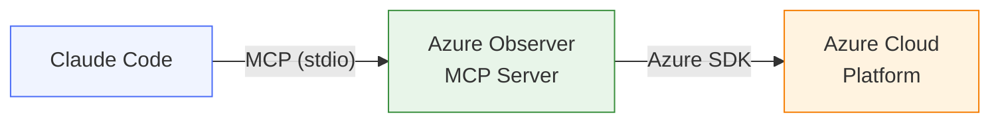
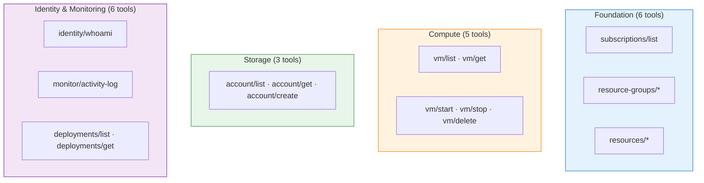
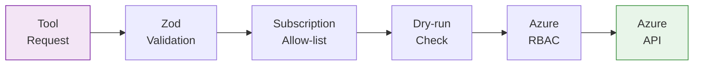

# Azure Observer MCP Server

An MCP (Model Context Protocol) server that enables Claude to provision, observe, and control Azure cloud resources. Authenticates via Azure Entra ID and exposes structured tools for managing Azure infrastructure.



## Quick Start

### Prerequisites

- **Node.js** >= 20
- **Azure CLI** installed and logged in (`az login`)
- An Azure subscription with appropriate permissions

### Install & Build

```bash
git clone https://github.com/your-username/azure-observer-mcp.git
cd azure-observer-mcp
npm install
npm run build
```

### Configure Claude Code

Add to your Claude Code MCP settings (`~/.claude/claude_desktop_config.json`):

```json
{
  "mcpServers": {
    "azure-observer": {
      "command": "node",
      "args": ["/absolute/path/to/azure-observer-mcp/dist/index.js"],
      "env": {
        "LOG_LEVEL": "info"
      }
    }
  }
}
```

### Authenticate

**Option 1 — Azure CLI (simplest):**

```bash
az login
```

**Option 2 — Service Principal:**

```json
{
  "env": {
    "AZURE_TENANT_ID": "your-tenant-id",
    "AZURE_CLIENT_ID": "your-client-id",
    "AZURE_CLIENT_SECRET": "your-client-secret"
  }
}
```

See the [Authentication Guide](./docs/authentication.md) for details on all supported methods.

### Verify

Ask Claude: *"Use the azure/identity/whoami tool to show my Azure identity."*

## Available Tools (20 total)



| Category | Tools |
|----------|-------|
| **Foundation** | `azure/subscriptions/list`, `azure/resource-groups/{list,create,delete}`, `azure/resources/{list,get}` |
| **Compute** | `azure/compute/vm/{list,get,start,stop,delete}` |
| **Storage** | `azure/storage/account/{list,get,create}` |
| **Identity** | `azure/identity/whoami` |
| **Monitoring** | `azure/monitor/activity-log`, `azure/deployments/{list,get}` |

See the [Tools Reference](./docs/tools-reference.md) for complete documentation with parameters and examples.

## Safety Features



- **Dry-Run Mode** — Set `AZURE_DRY_RUN=true` to preview all changes without executing
- **Subscription Allow-List** — Set `AZURE_ALLOWED_SUBSCRIPTIONS` to restrict access
- **Azure RBAC** — The server inherits your Azure permissions; it cannot exceed them
- **Input Validation** — All tool inputs validated with Zod schemas

See the [Security Guide](./docs/security.md) for the complete threat model and best practices.

## Configuration

| Variable | Required | Default | Description |
|----------|----------|---------|-------------|
| `AZURE_SUBSCRIPTION_ID` | No | First available | Default subscription |
| `AZURE_TENANT_ID` | No* | — | Entra ID tenant (* required for service principal) |
| `AZURE_CLIENT_ID` | No* | — | Service principal app ID |
| `AZURE_CLIENT_SECRET` | No* | — | Service principal secret |
| `AZURE_ALLOWED_SUBSCRIPTIONS` | No | All | Comma-separated subscription IDs |
| `AZURE_DRY_RUN` | No | `false` | Enable dry-run mode |
| `LOG_LEVEL` | No | `info` | `debug`, `info`, `warn`, `error` |

## Documentation

| Guide | Description |
|-------|-------------|
| [Getting Started](./docs/getting-started.md) | Installation, first run, and initial setup |
| [Authentication](./docs/authentication.md) | Azure Entra ID, service principals, managed identity |
| [Tools Reference](./docs/tools-reference.md) | Complete reference for all 20 tools |
| [Claude Integration](./docs/claude-integration.md) | Connecting with Claude Code and Claude Desktop |
| [Hosting Guide](./docs/hosting-guide.md) | Local, Docker, Azure VM, and Container Apps |
| [Use Cases & Workflows](./docs/use-cases.md) | Practical examples and multi-tool workflows |
| [Security](./docs/security.md) | Threat model, RBAC, and best practices |
| [Contributing](./docs/contributing.md) | How to add new tools and services |
| [Architecture](./ARCHITECTURE.md) | Solution architecture and design decisions |

## Development

```bash
npm run dev     # Run with tsx (hot reload)
npm run build   # Build for production
npm run lint    # Type check
```

## License

MIT
