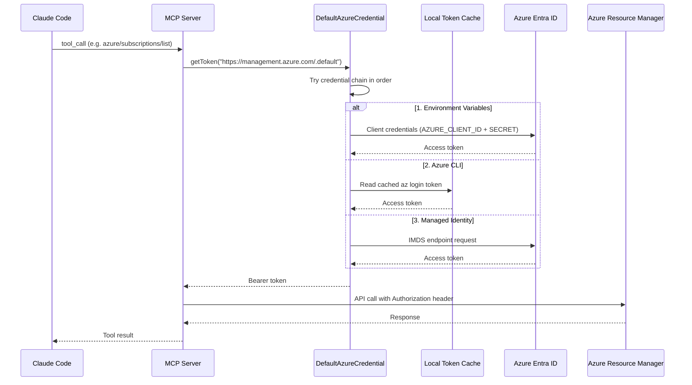
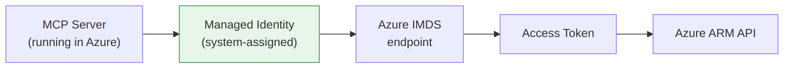
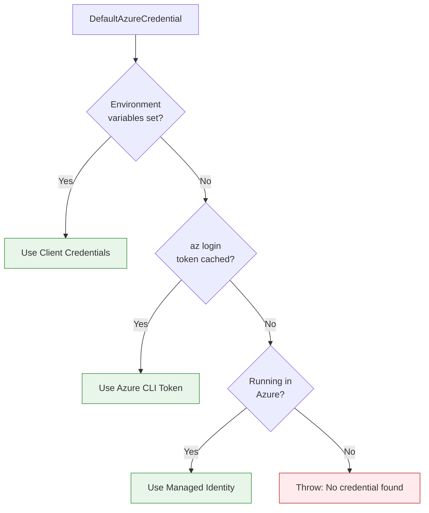
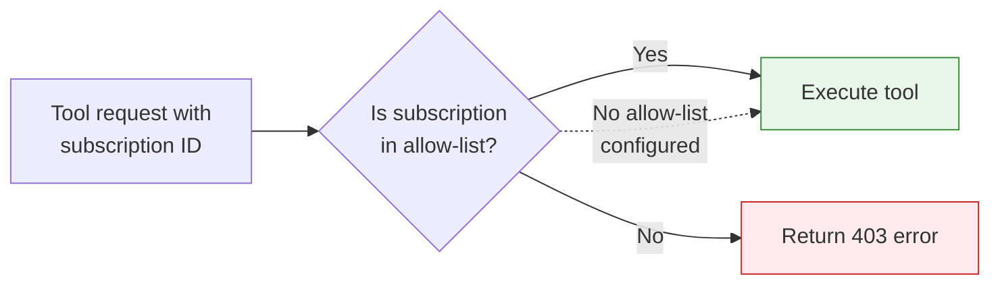

# Authentication Guide

Azure Observer authenticates to Azure using **Azure Entra ID** (formerly Azure Active Directory) via the `DefaultAzureCredential` chain from the `@azure/identity` SDK. This provides a flexible, secure authentication model that works across development, CI/CD, and production environments.

## How Authentication Works



## Authentication Methods

### Method 1: Azure CLI (Recommended for Development)

The simplest way to authenticate. No configuration needed.

```bash
az login
```

After signing in, the MCP server automatically uses your cached token. No environment variables required.

**When to use**: Local development, personal usage, quick testing.

**To switch subscriptions:**

```bash
az account set --subscription "your-subscription-id"
```

**To verify:**

```bash
az account show --output table
```

### Method 2: Service Principal (Recommended for Production)

Create a service principal in Azure Entra ID and pass its credentials via environment variables.

**Step 1: Create the service principal**

```bash
az ad sp create-for-rbac \
  --name "azure-observer-mcp" \
  --role "Reader" \
  --scopes "/subscriptions/YOUR_SUBSCRIPTION_ID" \
  --output json
```

This outputs:

```json
{
  "appId": "xxxxxxxx-xxxx-xxxx-xxxx-xxxxxxxxxxxx",
  "displayName": "azure-observer-mcp",
  "password": "xxxxxxxxxxxxxxxxxxxxxxxxxxxxxxxx",
  "tenant": "xxxxxxxx-xxxx-xxxx-xxxx-xxxxxxxxxxxx"
}
```

**Step 2: Configure environment variables**

In your Claude MCP config:

```json
{
  "mcpServers": {
    "azure-observer": {
      "command": "node",
      "args": ["/path/to/azure-observer-mcp/dist/index.js"],
      "env": {
        "AZURE_TENANT_ID": "your-tenant-id",
        "AZURE_CLIENT_ID": "your-app-id",
        "AZURE_CLIENT_SECRET": "your-password"
      }
    }
  }
}
```

**When to use**: CI/CD pipelines, shared team servers, production deployments.

### Method 3: Managed Identity (For Azure-hosted Servers)

When running the MCP server inside Azure (e.g., in a VM or Container App), managed identity requires zero secrets.



Enable system-assigned managed identity on your Azure resource, assign it the appropriate role, and `DefaultAzureCredential` will automatically detect and use it. No environment variables needed.

**When to use**: MCP server hosted on Azure VM, Container App, or App Service.

## Credential Chain Priority

`DefaultAzureCredential` tries these sources in order, using the first one that succeeds:



## Role Assignments

The authenticated identity needs appropriate Azure RBAC roles. Here are common role assignments:

| Scenario | Recommended Role | Scope |
|----------|-----------------|-------|
| Read-only observation | Reader | Subscription |
| Resource provisioning | Contributor | Subscription or Resource Group |
| Full management + IAM | Owner | Subscription |
| Specific service only | Service-specific role (e.g., VM Contributor) | Resource Group |

**Assign a role:**

```bash
az role assignment create \
  --assignee "your-app-id-or-upn" \
  --role "Contributor" \
  --scope "/subscriptions/YOUR_SUBSCRIPTION_ID"
```

## Subscription Scoping

Regardless of authentication method, you can restrict which subscriptions the server can access using the `AZURE_ALLOWED_SUBSCRIPTIONS` environment variable:

```json
{
  "env": {
    "AZURE_ALLOWED_SUBSCRIPTIONS": "sub-id-1,sub-id-2"
  }
}
```



Any tool call targeting a subscription not in the list will return a `SUBSCRIPTION_NOT_ALLOWED` error.

## Verifying Authentication

Use the `azure/identity/whoami` tool to verify your authentication status:

> "Show me my Azure identity using the whoami tool."

This returns:

```json
{
  "authenticated": true,
  "tenantId": "xxxxxxxx-xxxx-xxxx-xxxx-xxxxxxxxxxxx",
  "objectId": "xxxxxxxx-xxxx-xxxx-xxxx-xxxxxxxxxxxx",
  "upn": "user@example.com",
  "name": "John Doe",
  "dryRunEnabled": false,
  "allowedSubscriptions": "all"
}
```

## Troubleshooting

| Problem | Cause | Fix |
|---------|-------|-----|
| "No credential found" | No auth method available | Run `az login` or set service principal env vars |
| "AADSTS700016" | Wrong client ID | Verify `AZURE_CLIENT_ID` matches your app registration |
| "AADSTS7000215" | Wrong client secret | Regenerate the secret in Entra ID |
| Token expired | CLI token timed out | Run `az login` again |
| "AuthorizationFailed" | Insufficient permissions | Assign appropriate RBAC role to your identity |
