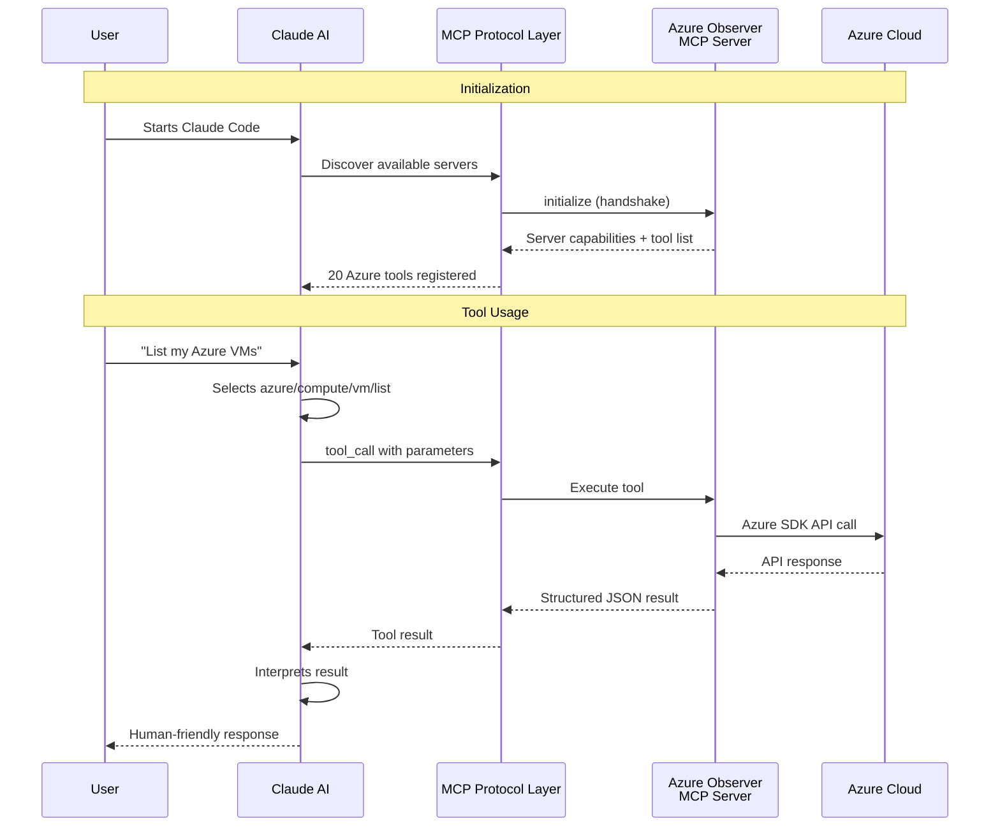
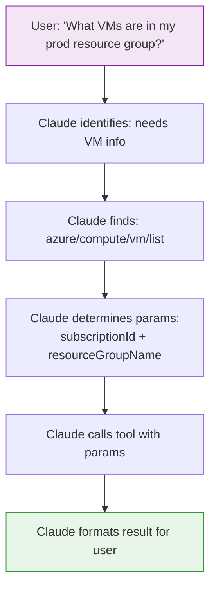
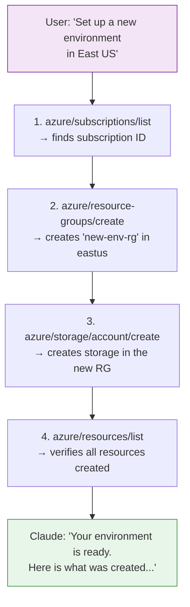

# Claude Integration Guide

This guide explains how to connect the Azure Observer MCP Server with Claude Code and Claude Desktop, and how to get the most out of the integration.

## How MCP Works with Claude



The Model Context Protocol creates a structured bridge between Claude's AI capabilities and your Azure infrastructure. Claude sees the tools as typed functions with descriptions, so it can intelligently select and chain them.

## Setting Up Claude Code

### Step 1: Locate Your Config File

Claude Code reads MCP server configurations from:

| Platform | Config path |
|----------|-------------|
| macOS | `~/.claude/claude_desktop_config.json` |
| Linux | `~/.claude/claude_desktop_config.json` |
| Windows | `%APPDATA%\Claude\claude_desktop_config.json` |

### Step 2: Add the Server Configuration

```json
{
  "mcpServers": {
    "azure-observer": {
      "command": "node",
      "args": ["/absolute/path/to/azure-observer-mcp/dist/index.js"],
      "env": {
        "LOG_LEVEL": "info"
      }
    }
  }
}
```

### Step 3: Restart Claude

Close and reopen Claude Code. The server will be auto-discovered.

### Step 4: Verify

Ask Claude:

> "What MCP tools do you have available for Azure?"

Claude should list all 20 azure/* tools.

## Setting Up Claude Desktop

Claude Desktop uses the same config format. Go to **Settings > Developer > Edit Config** and add the same `mcpServers` block.

## Configuration Variants

### Basic (Azure CLI Auth)

```json
{
  "mcpServers": {
    "azure-observer": {
      "command": "node",
      "args": ["/path/to/dist/index.js"]
    }
  }
}
```

### Production (Service Principal + Safety)

```json
{
  "mcpServers": {
    "azure-observer": {
      "command": "node",
      "args": ["/path/to/dist/index.js"],
      "env": {
        "AZURE_TENANT_ID": "your-tenant-id",
        "AZURE_CLIENT_ID": "your-client-id",
        "AZURE_CLIENT_SECRET": "your-secret",
        "AZURE_ALLOWED_SUBSCRIPTIONS": "prod-sub-id",
        "AZURE_DRY_RUN": "true",
        "LOG_LEVEL": "warn"
      }
    }
  }
}
```

### Read-Only Observer

```json
{
  "mcpServers": {
    "azure-observer": {
      "command": "node",
      "args": ["/path/to/dist/index.js"],
      "env": {
        "AZURE_DRY_RUN": "true",
        "LOG_LEVEL": "info"
      }
    }
  }
}
```

## How Claude Selects Tools

Claude uses tool names and descriptions to decide which tool to call. The `azure/{service}/{action}` naming convention helps Claude understand the tool hierarchy:



### Tips for Better Tool Selection

1. **Be specific**: "List VMs in the 'prod-rg' resource group" works better than "show me some servers"
2. **Provide IDs when you can**: "Use subscription `abc-123`" saves Claude from having to list subscriptions first
3. **Chain naturally**: "Create a resource group called 'test-rg' in eastus, then create a storage account in it" — Claude will chain multiple tools

## Multi-Tool Workflows

Claude can chain tools together in a single conversation:



## Troubleshooting

### Server Not Appearing in Claude

1. Check the config file path is correct
2. Verify the `args` path points to the built `dist/index.js`
3. Ensure Node.js 20+ is installed and in your PATH
4. Restart Claude Code completely

### Tools Returning Errors

1. Run `azure/identity/whoami` to verify authentication
2. Check if `AZURE_DRY_RUN` is set when you expect real operations
3. Verify subscription IDs are correct and in your allow-list
4. Check Azure RBAC — your identity needs appropriate permissions

### Debugging

Set `LOG_LEVEL` to `debug` in your config:

```json
{
  "env": {
    "LOG_LEVEL": "debug"
  }
}
```

Logs go to stderr and won't interfere with the MCP protocol. Check the Claude Code output panel for log messages.
