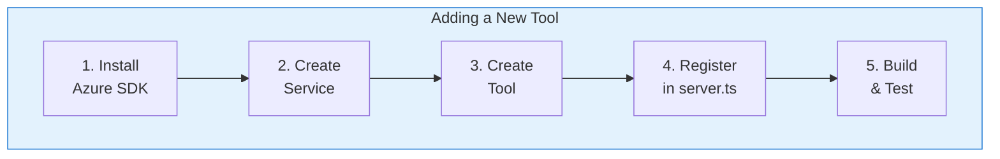
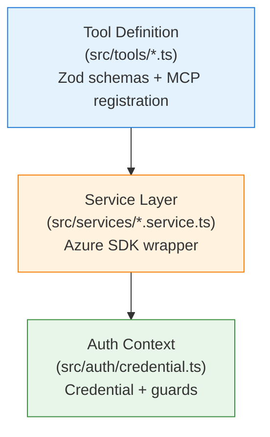
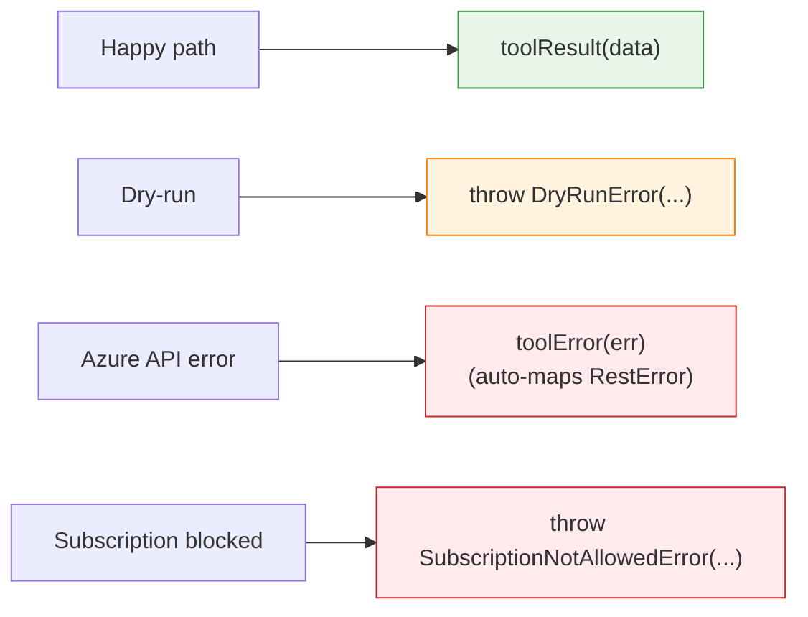

# Contributing Guide

This guide explains how to add new tools, services, and capabilities to the Azure Observer MCP Server.

## Architecture Overview



Every tool follows the same three-layer pattern:



## Step-by-Step: Adding a New Tool

Let's walk through adding a hypothetical **Azure SQL Database** tool set.

### Step 1: Install the Azure SDK Package

```bash
npm install @azure/arm-sql
```

### Step 2: Create the Service

Create `src/services/sql.service.ts`:

```typescript
import { SqlManagementClient } from "@azure/arm-sql";
import type { AzureContext } from "../auth/credential.js";
import { DryRunError } from "../lib/errors.js";

export class SqlService {
  private getClient(subscriptionId: string) {
    this.ctx.assertSubscriptionAllowed(subscriptionId);
    return new SqlManagementClient(this.ctx.credential, subscriptionId);
  }

  constructor(private ctx: AzureContext) {}

  async listServers(subscriptionId: string, resourceGroupName: string) {
    const client = this.getClient(subscriptionId);
    const servers = [];

    for await (const server of client.servers.listByResourceGroup(resourceGroupName)) {
      servers.push({
        id: server.id ?? "",
        name: server.name ?? "",
        location: server.location ?? "",
        state: server.state ?? "Unknown",
        fullyQualifiedDomainName: server.fullyQualifiedDomainName ?? "",
      });
    }

    return servers;
  }
}
```

**Key patterns**:
- Constructor takes `AzureContext` (provides credential + config)
- `getClient()` helper creates SDK client and checks subscription allow-list
- Methods return clean, typed objects (not raw SDK responses)
- Mutating methods check `this.ctx.config.dryRun` and throw `DryRunError`

### Step 3: Create the Tool Definition

Create `src/tools/sql.ts`:

```typescript
import { z } from "zod";
import type { McpServer } from "@modelcontextprotocol/sdk/server/mcp.js";
import type { SqlService } from "../services/sql.service.js";
import { toolResult, toolError } from "../lib/errors.js";

export function registerSqlTools(
  server: McpServer,
  sqlService: SqlService,
) {
  server.tool(
    "azure/sql/server/list",
    "List Azure SQL servers in a resource group",
    {
      subscriptionId: z.string().describe("Azure subscription ID"),
      resourceGroupName: z.string().describe("Resource group name"),
    },
    async ({ subscriptionId, resourceGroupName }) => {
      try {
        const servers = await sqlService.listServers(subscriptionId, resourceGroupName);
        return toolResult({ count: servers.length, servers });
      } catch (err) {
        return toolError(err);
      }
    },
  );
}
```

**Key patterns**:
- Tool name follows `azure/{service}/{resource}/{action}` convention
- Description is human-readable (Claude uses it to select tools)
- Every parameter has a `.describe()` string
- `try/catch` with `toolResult()` / `toolError()` for consistent response format

### Step 4: Register in server.ts

Edit `src/server.ts`:

```typescript
import { SqlService } from "./services/sql.service.js";
import { registerSqlTools } from "./tools/sql.js";

export function createServer(azureCtx: AzureContext): McpServer {
  // ... existing code ...

  const sqlService = new SqlService(azureCtx);
  registerSqlTools(server, sqlService);

  // ... rest of function ...
}
```

### Step 5: Build & Test

```bash
npm run lint    # Type check
npm run build   # Build
```

Then in Claude: "List Azure SQL servers in my resource group."

## Code Conventions

### Tool Naming

```
azure/{service}/{resource}/{action}
```

| Part | Examples |
|------|---------|
| service | `compute`, `storage`, `sql`, `network` |
| resource | `vm`, `account`, `server`, `vnet` |
| action | `list`, `get`, `create`, `delete`, `start`, `stop` |

### Error Handling

Always use the helpers from `src/lib/errors.ts`:



### Service Pattern

```typescript
export class MyService {
  // 1. Helper to create scoped SDK client
  private getClient(subscriptionId: string) {
    this.ctx.assertSubscriptionAllowed(subscriptionId);
    return new SomeAzureClient(this.ctx.credential, subscriptionId);
  }

  // 2. Inject AzureContext
  constructor(private ctx: AzureContext) {}

  // 3. Read methods — just call SDK and reshape data
  async list(subscriptionId: string) { /* ... */ }

  // 4. Mutating methods — check dryRun first
  async create(subscriptionId: string, params: CreateParams) {
    if (this.ctx.config.dryRun) {
      throw new DryRunError("create", params);
    }
    // ... actual SDK call ...
  }
}
```

## Development Workflow

```bash
npm run dev     # Run with tsx (auto-reload on save)
npm run lint    # TypeScript type checking
npm run build   # Production build with tsup
npm run clean   # Remove dist/
```

## Project Structure Reference

```
src/
├── index.ts              # Entry point (stdio transport)
├── server.ts             # Tool registration hub (edit this to add tools)
├── auth/
│   └── credential.ts     # Azure credential + subscription guard
├── tools/                # One file per tool category
│   ├── subscriptions.ts
│   ├── resource-groups.ts
│   ├── resources.ts
│   ├── compute.ts
│   ├── storage.ts
│   ├── identity.ts
│   ├── monitor.ts
│   └── deployments.ts
├── services/             # One file per Azure service
│   ├── subscription.service.ts
│   ├── resource.service.ts
│   ├── compute.service.ts
│   ├── storage.service.ts
│   ├── identity.service.ts
│   └── monitor.service.ts
└── lib/                  # Shared utilities
    ├── config.ts         # Environment config
    ├── errors.ts         # Error types + helpers
    └── logger.ts         # pino logger (stderr)
```

## Checklist for New Tools

- [ ] Azure SDK package installed
- [ ] Service created in `src/services/`
- [ ] Service checks `assertSubscriptionAllowed()` on every method
- [ ] Mutating methods check `dryRun` and throw `DryRunError`
- [ ] Tool file created in `src/tools/` with Zod schemas
- [ ] Every parameter has a `.describe()` string for Claude
- [ ] Tool registered in `src/server.ts`
- [ ] `npm run lint` passes
- [ ] `npm run build` succeeds
- [ ] Tool tested manually in Claude
