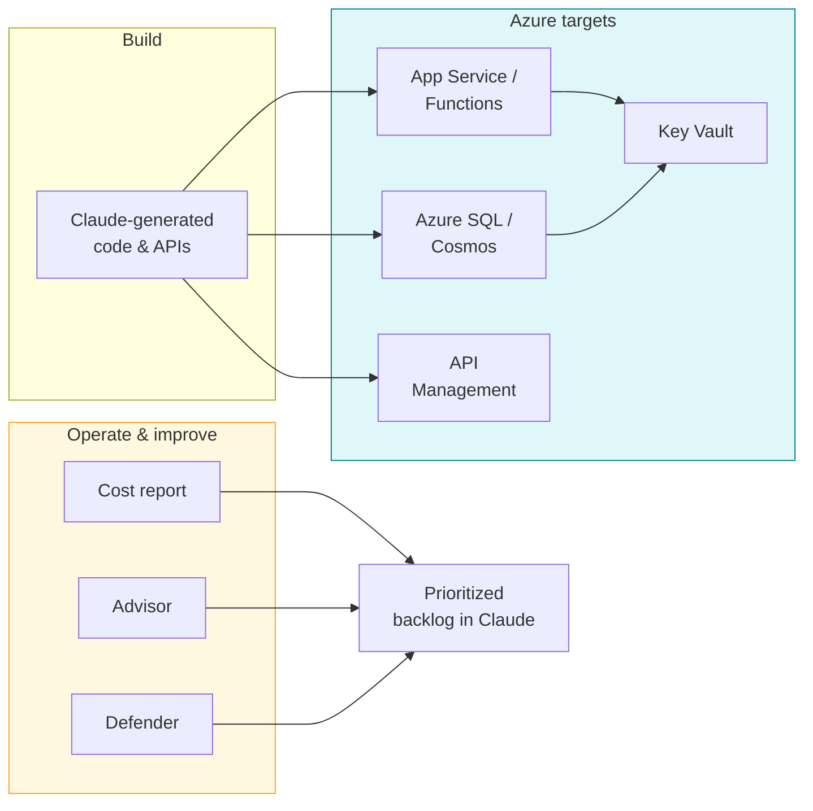
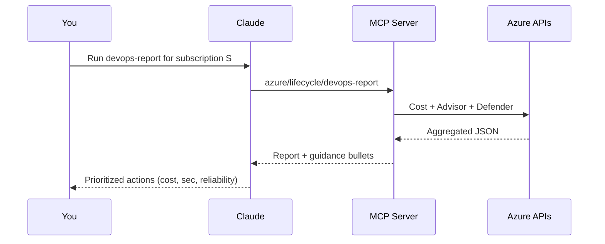
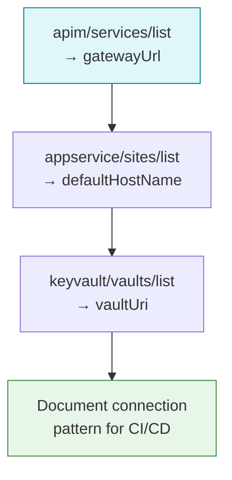
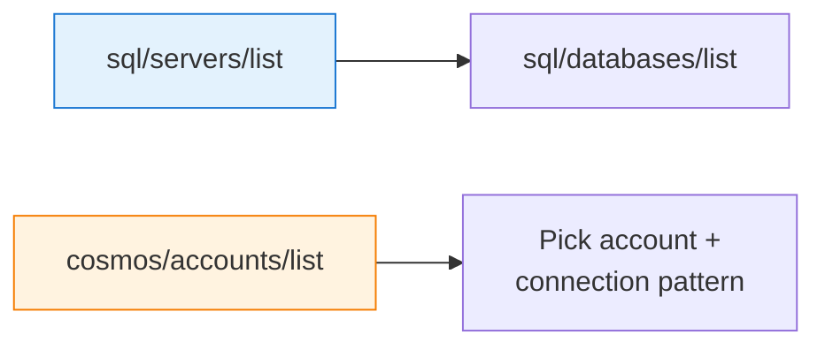

# DevOps, Billing & Security Workflows (Claude Code / CLI)

This guide describes **use-case workflows** for the tools added in v0.2: billing reports, Azure Advisor, Microsoft Defender for Cloud, and application stack discovery (App Service, SQL, API Management, Cosmos DB, Key Vault), plus the composite **`azure/lifecycle/devops-report`**.

## How these tools fit the lifecycle

## RBAC: what permissions you need

| Tool area | Typical roles |
|-----------|----------------|
| Cost / billing | [Cost Management Reader](https://learn.microsoft.com/azure/role-based-access-control/built-in-roles#cost-management-reader) (or Reader + cost APIs where allowed) |
| Azure Advisor | Reader (recommendations are subscription-scoped) |
| Defender alerts & assessments | [Security Reader](https://learn.microsoft.com/azure/role-based-access-control/built-in-roles#security-reader) or Defender-related roles |
| App Service / SQL / APIM / Cosmos / Key Vault (list/get) | Reader at subscription or RG |
| Mutating tools (RG, storage, VM, etc.) | Contributor as needed |

If a call returns `403` or `AuthorizationFailed`, assign the least-privilege role for that API.

---

## Workflow 1 — Weekly “health & cost” review (Claude CLI)

Use when you want a **single structured snapshot** for prioritization.

**Example prompts**

1. "Call `azure/lifecycle/devops-report` with my subscription ID. Summarize top cost drivers and top security findings."
2. "From the same report, propose a 2-week remediation plan: Security first, then Cost."

---

## Workflow 2 — Map a Claude-built API from code to Azure

Use **`azure/apim/services/list`** and **`azure/appservice/sites/list`** to connect **gateway URL** ↔ **app default hostname** ↔ **Key Vault** for secrets.

**Example prompts**

1. "List API Management services and their gateway URLs."
2. "List App Service sites in the same subscription; which ones look like APIs (kind, hostnames)?"
3. "List Key Vaults we should use for connection strings instead of plain app settings."

---

## Workflow 3 — Database layer for a new feature

**Example prompts**

1. "List SQL servers and databases in resource group `data-rg`."
2. "List Cosmos accounts; which region matches our App Service?"

---

## Workflow 4 — Security scanning backlog (Defender)

1. **`azure/security/defender/alerts/list`** — active threats and detections.  
2. **`azure/security/defender/assessments/list`** — posture; filter **Unhealthy** in Claude for remediation.  
3. Cross-check with **`azure/advisor/recommendations/list`** category `Security`.

**Example prompt**: "List Defender alerts and unhealthy assessments; group by resource type and suggest fixes."

---

## Workflow 5 — Billing investigation

1. **`azure/billing/cost-report`** with `groupBy: ServiceName` and `timeframe: MonthToDate`.  
2. If a service spikes (e.g. App Service), drill into **`azure/appservice/plans/list`** and **`azure/resources/list`** for the RG.

**Example prompt**: "Show MTD cost by service; then explain which App Service plans might drive the App Service line item."

---

## SDK note (transparency)

Billing uses `@azure/arm-costmanagement` (current **beta** track). If your org pins to strict production-only SDKs, validate compatibility with your supply-chain policy. Advisor, Defender, and resource providers use stable management SDKs.

---

## See also

- [Tools reference](./tools-reference.md) — full parameter tables  
- [Security](./security.md) — defense in depth and RBAC  
- [Authentication](./authentication.md) — service principals and scopes  
