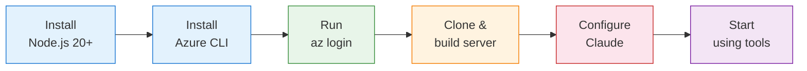

# Getting Started

This guide walks you through installing, configuring, and running the Azure Observer MCP Server for the first time.

## Prerequisites

Before you begin, ensure you have:

- **Node.js 20+** — [Download here](https://nodejs.org/)
- **Azure CLI** — [Install guide](https://learn.microsoft.com/en-us/cli/azure/install-azure-cli)
- **An Azure subscription** with at least Reader permissions
- **Claude Code** or **Claude Desktop** installed



## Step 1: Clone and Build

```bash
git clone https://github.com/your-username/azure-observer-mcp.git
cd azure-observer-mcp
npm install
npm run build
```

This produces a single bundled file at `dist/index.js`.

## Step 2: Authenticate with Azure

The simplest approach — use Azure CLI:

```bash
az login
```

This opens a browser window. Sign in with your Azure account. The MCP server will automatically use your cached credentials.

To verify it worked:

```bash
az account show
```

You should see your subscription details.

## Step 3: Configure Claude

### Claude Code (CLI)

Create or edit `~/.claude/claude_desktop_config.json`:

```json
{
  "mcpServers": {
    "azure-observer": {
      "command": "node",
      "args": ["/absolute/path/to/azure-observer-mcp/dist/index.js"],
      "env": {
        "LOG_LEVEL": "info"
      }
    }
  }
}
```

> Replace `/absolute/path/to/` with the actual path where you cloned the repository.

### Claude Desktop App

Go to **Settings > Developer > MCP Servers > Add** and use the same configuration as above.

## Step 4: Verify the Connection

Open Claude Code and try:

> "Use the azure/identity/whoami tool to show my Azure identity."

Claude should respond with your authenticated identity details, including your tenant ID, user principal name, and server configuration.

## Step 5: Try Your First Commands

Here are some simple things to try:

| What to ask Claude | What happens |
|---|---|
| "List my Azure subscriptions" | Calls `azure/subscriptions/list` |
| "Show resource groups in subscription `{id}`" | Calls `azure/resource-groups/list` |
| "What resources are in the `my-rg` resource group?" | Calls `azure/resources/list` |
| "Show me the recent activity log" | Calls `azure/monitor/activity-log` |

## What's Next

- **[Authentication Guide](./authentication.md)** — Service principals, managed identity, and scoping
- **[Tools Reference](./tools-reference.md)** — Complete reference for all 20 tools
- **[Claude Integration Guide](./claude-integration.md)** — Advanced Claude configuration
- **[Security Guide](./security.md)** — Dry-run mode, allow-lists, and RBAC
