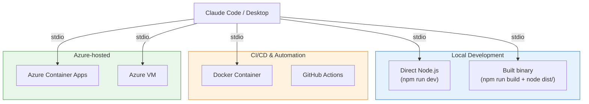
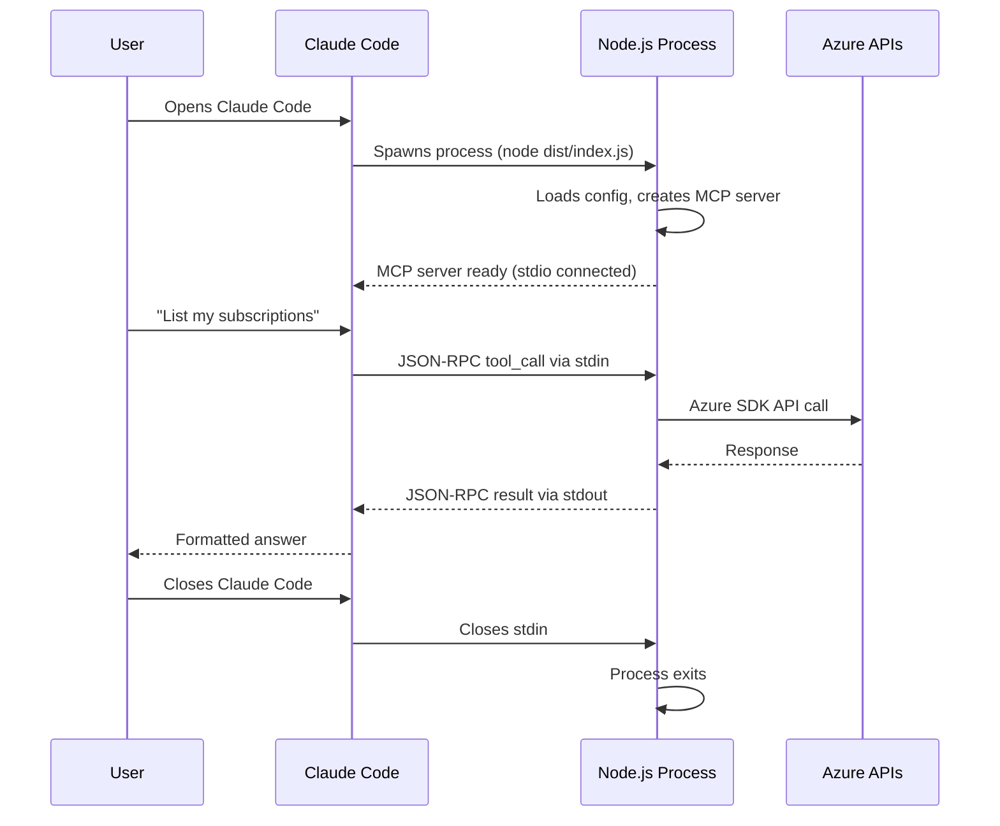
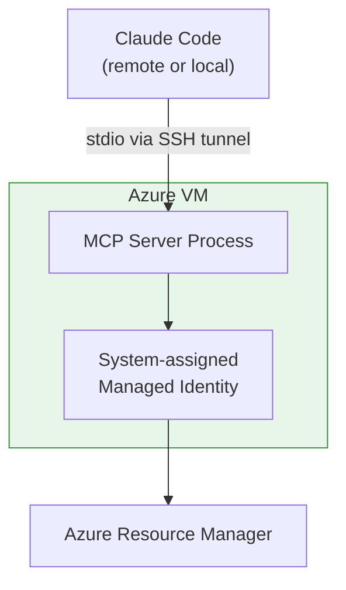
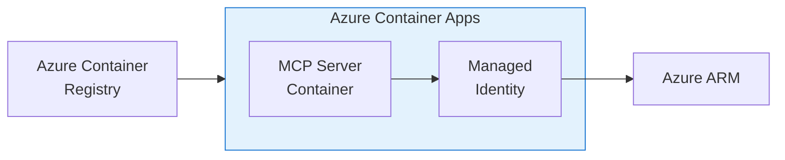

# Hosting Guide

This guide covers how to run and host the Azure Observer MCP Server across different environments.

## Hosting Options



---

## Option 1: Local Development (Recommended Start)

The simplest way to run the server. Claude Code spawns it as a local process using stdio transport.

### Build & Run

```bash
npm install
npm run build
```

### Configure Claude

In `~/.claude/claude_desktop_config.json`:

```json
{
  "mcpServers": {
    "azure-observer": {
      "command": "node",
      "args": ["/absolute/path/to/azure-observer-mcp/dist/index.js"],
      "env": {
        "LOG_LEVEL": "info"
      }
    }
  }
}
```

### Development Mode

For active development with auto-reload:

```bash
npm run dev
```

This uses `tsx` to run TypeScript directly without a build step.

### How It Works



---

## Option 2: Docker Container

Package the server as a Docker container for consistent environments.

### Dockerfile

Create a `Dockerfile` in the project root:

```dockerfile
FROM node:20-slim

WORKDIR /app
COPY package*.json ./
RUN npm ci --production
COPY dist/ ./dist/

ENTRYPOINT ["node", "dist/index.js"]
```

### Build & Run

```bash
npm run build
docker build -t azure-observer-mcp .
```

### Configure Claude with Docker

```json
{
  "mcpServers": {
    "azure-observer": {
      "command": "docker",
      "args": [
        "run", "--rm", "-i",
        "-e", "AZURE_TENANT_ID",
        "-e", "AZURE_CLIENT_ID",
        "-e", "AZURE_CLIENT_SECRET",
        "azure-observer-mcp"
      ],
      "env": {
        "AZURE_TENANT_ID": "your-tenant-id",
        "AZURE_CLIENT_ID": "your-client-id",
        "AZURE_CLIENT_SECRET": "your-secret"
      }
    }
  }
}
```

> Note: When running in Docker, Azure CLI auth is not available. Use a service principal instead.

---

## Option 3: Azure VM with Managed Identity

Host the MCP server on an Azure VM and use managed identity for zero-secret authentication.



### Setup Steps

1. **Create a VM** with system-assigned managed identity enabled
2. **Assign roles** to the managed identity:

```bash
az role assignment create \
  --assignee-object-id $(az vm show -g myRG -n myVM --query identity.principalId -o tsv) \
  --role "Contributor" \
  --scope "/subscriptions/YOUR_SUB_ID"
```

3. **Install Node.js and the server** on the VM:

```bash
curl -fsSL https://deb.nodesource.com/setup_20.x | sudo -E bash -
sudo apt-get install -y nodejs
git clone https://github.com/your-username/azure-observer-mcp.git
cd azure-observer-mcp
npm ci && npm run build
```

4. **Run via SSH tunnel** from your local machine:

```json
{
  "mcpServers": {
    "azure-observer": {
      "command": "ssh",
      "args": [
        "user@your-vm-ip",
        "node /home/user/azure-observer-mcp/dist/index.js"
      ]
    }
  }
}
```

---

## Option 4: Azure Container Apps

For a fully managed, serverless hosting option.



### Steps

1. Push your Docker image to Azure Container Registry
2. Create a Container App with system-assigned managed identity
3. Assign RBAC roles to the managed identity
4. Configure ingress for stdio-over-HTTP (requires future HTTP transport support)

> Note: Full Container Apps support will be available with the Streamable HTTP transport (planned for v5). Currently, stdio-based hosting works best with VM or local deployment.

---

## Environment Variables

All hosting options support the same environment variables:

| Variable | Required | Default | Description |
|----------|----------|---------|-------------|
| `AZURE_SUBSCRIPTION_ID` | No | First available | Default subscription |
| `AZURE_TENANT_ID` | No* | — | Required for service principal |
| `AZURE_CLIENT_ID` | No* | — | Required for service principal |
| `AZURE_CLIENT_SECRET` | No* | — | Required for service principal |
| `AZURE_ALLOWED_SUBSCRIPTIONS` | No | All | Restrict accessible subscriptions |
| `AZURE_DRY_RUN` | No | `false` | Preview-only mode |
| `LOG_LEVEL` | No | `info` | Logging verbosity |

## Hosting Comparison

| Feature | Local Node.js | Docker | Azure VM | Container Apps |
|---------|---------------|--------|----------|----------------|
| Setup effort | Minimal | Low | Medium | Medium |
| Auth methods | CLI, SP | SP only | MI, SP | MI, SP |
| Zero secrets | Yes (az login) | No | Yes (MI) | Yes (MI) |
| Team sharing | No | No | Yes (SSH) | Yes (HTTP*) |
| Auto-scaling | No | No | No | Yes |
| Recommended for | Development | CI/CD | Production | Future |

*HTTP transport support is planned for a future release.
