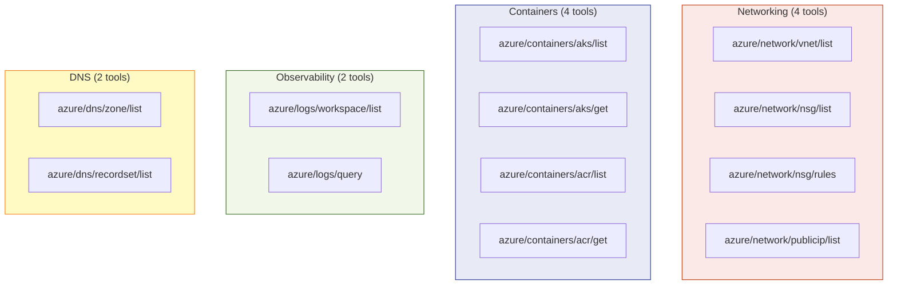
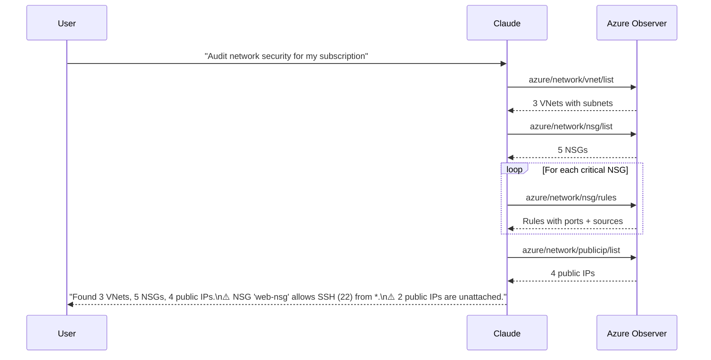
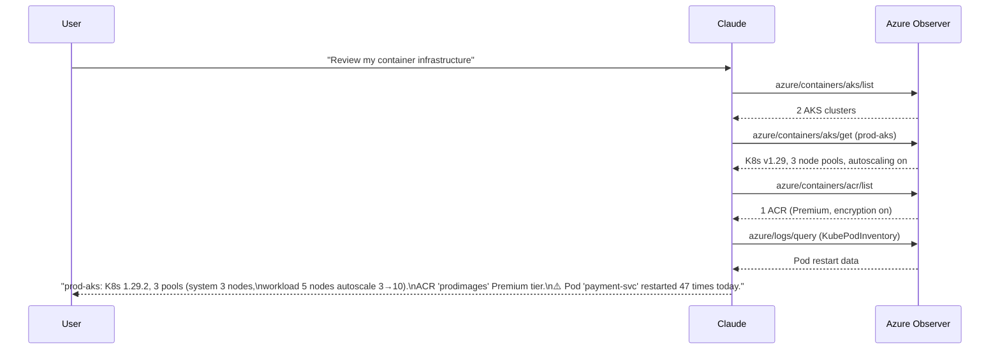
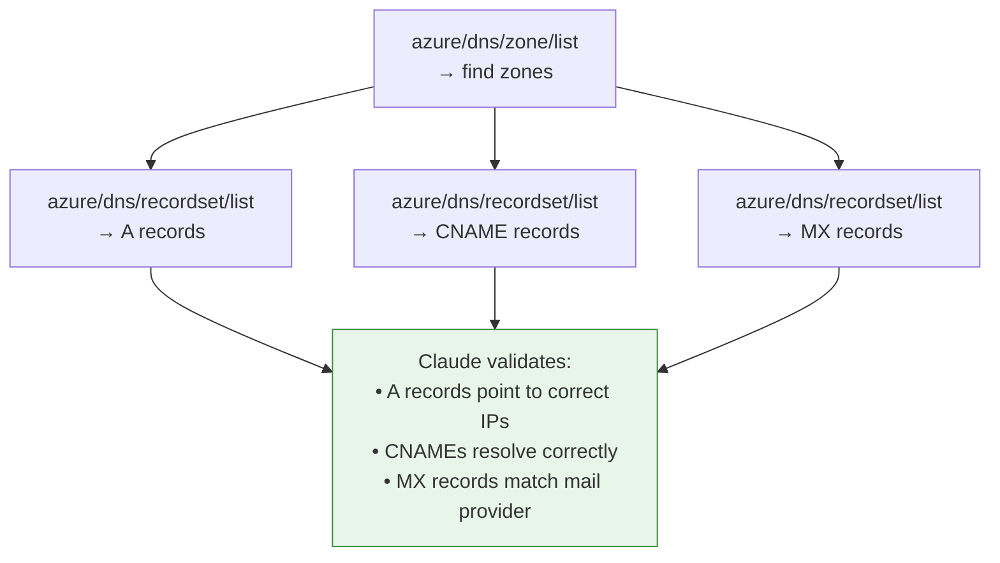

# Networking, Containers & Observability Guide

This guide covers the v0.3 tool categories — **Networking**, **Containers (AKS/ACR)**, **Log Analytics + KQL**, and **DNS** — with RBAC requirements, workflows, and Claude-oriented examples.

## Tool Map



---

## RBAC Requirements

| Tool category | Minimum Azure role | Scope |
|---|---|---|
| `azure/network/*` | **Reader** | Subscription or resource group |
| `azure/containers/aks/*` | **Reader** | Subscription or resource group |
| `azure/containers/acr/*` | **Reader** | Subscription or resource group |
| `azure/logs/workspace/list` | **Reader** | Subscription |
| `azure/logs/query` | **Log Analytics Reader** | Log Analytics workspace |
| `azure/dns/*` | **Reader** | Subscription or resource group |

```bash
# Grant Log Analytics Reader for KQL queries
az role assignment create \
  --assignee "your-identity" \
  --role "Log Analytics Reader" \
  --scope "/subscriptions/YOUR_SUB/resourceGroups/YOUR_RG/providers/Microsoft.OperationalInsights/workspaces/YOUR_WORKSPACE"
```

---

## Workflow: Full Network Topology Audit



---

## Workflow: Container Platform Review



---

## KQL Query Cookbook

These KQL queries work with the `azure/logs/query` tool. Pass the workspace `customerId` (GUID) as `workspaceId`.

### Infrastructure & Activity

```kql
// Recent resource changes
AzureActivity
| where OperationNameValue has "write" or OperationNameValue has "delete"
| project TimeGenerated, Caller, OperationNameValue, ResourceGroup, ActivityStatusValue
| top 50 by TimeGenerated desc
```

### Kubernetes (requires Container Insights)

```kql
// Pods with high restart counts
KubePodInventory
| summarize Restarts = sum(PodRestartCount) by Name, Namespace, ClusterName
| where Restarts > 0
| top 20 by Restarts desc
```

```kql
// Node CPU pressure
Perf
| where ObjectName == "K8SNode" and CounterName == "cpuUsageNanoCores"
| summarize AvgCPU = avg(CounterValue) by Computer, bin(TimeGenerated, 5m)
| top 20 by AvgCPU desc
```

### Application Insights

```kql
// Failed HTTP requests by URL
requests
| where success == false
| summarize FailCount = count() by name, resultCode
| top 20 by FailCount desc
```

```kql
// Exceptions with stack traces
exceptions
| project TimeGenerated, type, outerMessage, innermostMessage
| top 30 by TimeGenerated desc
```

### Security

```kql
// Failed sign-ins
SigninLogs
| where ResultType != "0"
| summarize Failures = count() by UserPrincipalName, AppDisplayName, ResultDescription
| top 20 by Failures desc
```

---

## Workflow: DNS Validation Before Migration



**Try saying**:

> "Before we migrate contoso.com, show me all DNS records — A, CNAME, and MX — and verify they make sense."

---

## Combining with Existing Tools

The real power comes from combining v0.3 tools with existing capabilities:

| Scenario | Tools used |
|---|---|
| "Is my app network-secure?" | `nsg/rules` + `publicip/list` + `defender/assessments` |
| "Why is my AKS app slow?" | `aks/get` + `logs/query` (KQL for pod metrics) + `advisor/recommendations` |
| "Full infrastructure report" | `lifecycle/devops-report` + `vnet/list` + `aks/list` + `acr/list` |
| "Cost of my AKS clusters" | `aks/list` + `billing/cost-report` (group by ResourceGroupName) |
| "Secure my container pipeline" | `acr/get` (encryption check) + `nsg/rules` + `keyvault/vaults/list` |
