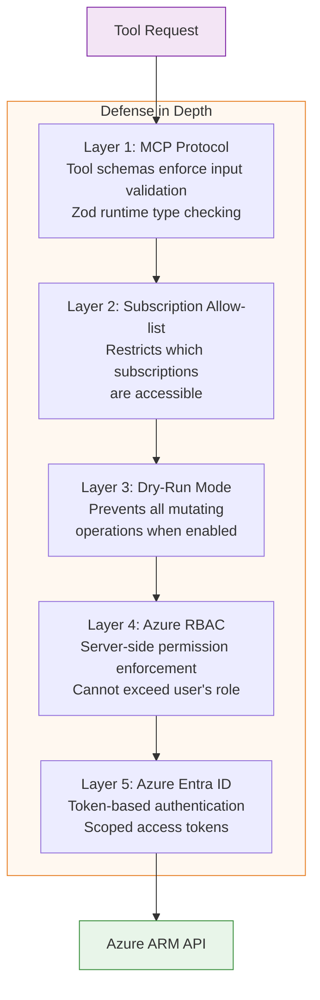
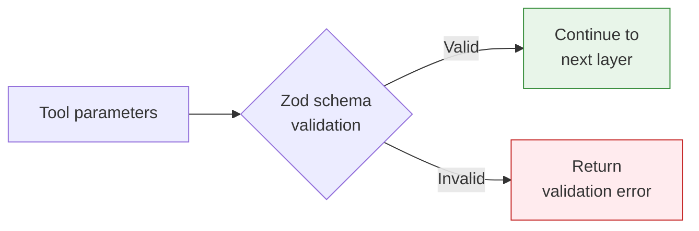
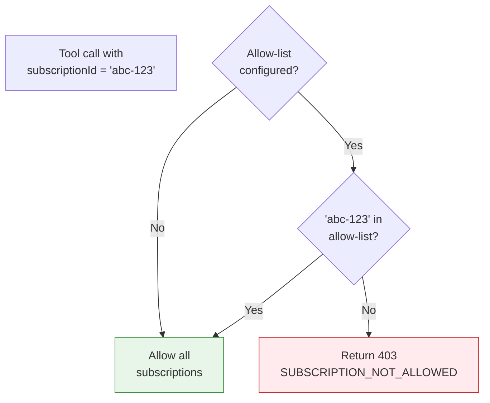
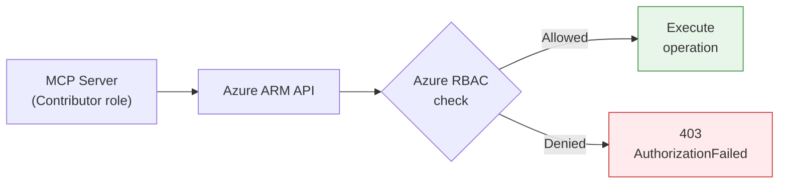
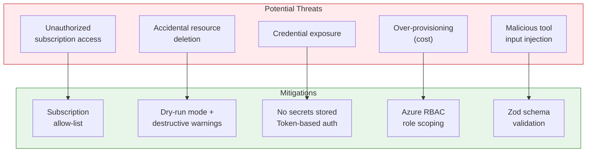

# Security Guide

Azure Observer MCP Server is designed with a **defense-in-depth** security model. Multiple layers of protection ensure that Claude can only perform authorized actions on your Azure infrastructure.

## Security Architecture



## Layer 1: Input Validation (Zod)

Every tool input is validated at runtime using Zod schemas before any Azure API call is made.



What Zod validates:
- **Type checking**: `subscriptionId` must be a string, `daysBack` must be a number
- **Constraints**: Storage account names are 3-24 characters, `maxEvents` is 1-200
- **Required fields**: Missing parameters are rejected before reaching Azure

## Layer 2: Subscription Allow-List

Restrict which Azure subscriptions the server can access.

### Configuration

```bash
AZURE_ALLOWED_SUBSCRIPTIONS="sub-id-1,sub-id-2"
```

### How It Works



When a tool targets a subscription not in the allow-list, the request is immediately rejected — no Azure API call is made.

## Layer 3: Dry-Run Mode

When enabled, all mutating operations return a preview of what **would** happen without making any changes.

### Configuration

```bash
AZURE_DRY_RUN=true
```

### Affected Operations

| Tool | Behavior in Dry-Run |
|------|---------------------|
| `azure/resource-groups/create` | Returns planned RG details |
| `azure/resource-groups/delete` | Returns what would be deleted |
| `azure/compute/vm/start` | Returns VM that would be started |
| `azure/compute/vm/stop` | Returns VM that would be stopped |
| `azure/compute/vm/delete` | Returns VM that would be deleted |
| `azure/storage/account/create` | Returns planned account details |

Read-only tools (`list`, `get`, `whoami`, `activity-log`) work normally in dry-run mode.

### Dry-Run Response Example

When dry-run is active and Claude tries to create a resource group:

```json
{
  "isError": true,
  "content": "DRY RUN — createResourceGroup\nParameters: {\n  \"subscriptionId\": \"abc-123\",\n  \"name\": \"test-rg\",\n  \"location\": \"eastus\"\n}\n\nNo changes were made. Set AZURE_DRY_RUN=false to execute."
}
```

## Layer 4: Azure RBAC

The MCP server inherits the permissions of the authenticated identity. Azure Role-Based Access Control (RBAC) is enforced server-side by Azure itself.



**Key principle**: The MCP server can never do more than what your Azure identity is allowed to do.

### Recommended Role Assignments

| Use Case | Azure Role | Scope |
|----------|-----------|-------|
| Read-only monitoring | Reader | Subscription |
| Dev environment management | Contributor | Specific resource group |
| Full provisioning | Contributor | Subscription |
| Admin + IAM | Owner | Subscription |
| Cost / billing reports (`azure/billing/cost-report`) | [Cost Management Reader](https://learn.microsoft.com/azure/role-based-access-control/built-in-roles#cost-management-reader) (or equivalent) | Subscription or billing scope |
| Defender alerts & assessments | [Security Reader](https://learn.microsoft.com/azure/role-based-access-control/built-in-roles#security-reader) or Defender roles | Subscription |

### Principle of Least Privilege

Assign the minimum role needed:

```bash
# Read-only observer
az role assignment create \
  --assignee "your-identity" \
  --role "Reader" \
  --scope "/subscriptions/YOUR_SUB_ID"

# Dev-only contributor
az role assignment create \
  --assignee "your-identity" \
  --role "Contributor" \
  --scope "/subscriptions/YOUR_SUB_ID/resourceGroups/dev-rg"
```

## Layer 5: Azure Entra ID Authentication

All API calls use OAuth 2.0 bearer tokens issued by Azure Entra ID. Tokens are:
- **Scoped** to `https://management.azure.com/.default`
- **Short-lived** (typically 1 hour, auto-refreshed)
- **Audience-restricted** to Azure Resource Manager

No secrets are stored by the MCP server. Credentials flow through `DefaultAzureCredential` which manages token lifecycle.

## Threat Model



## Security Best Practices

### For Development

1. Use `az login` for authentication
2. Enable `AZURE_DRY_RUN=true` while learning the tools
3. Set `AZURE_ALLOWED_SUBSCRIPTIONS` to your dev subscription only

### For Production

1. Use a **service principal** with minimum required roles
2. Keep `AZURE_DRY_RUN=true` unless you explicitly need mutations
3. Restrict subscriptions to only what's needed
4. Set `LOG_LEVEL=warn` to reduce log noise
5. Rotate service principal secrets regularly
6. Monitor the Azure Activity Log for unexpected operations

### Never Do

- Never commit `.env` files or secrets to source control
- Never assign Owner role unless IAM management is required
- Never disable RBAC or use unrestricted credentials
- Never run with `LOG_LEVEL=debug` in production (may log token metadata)
