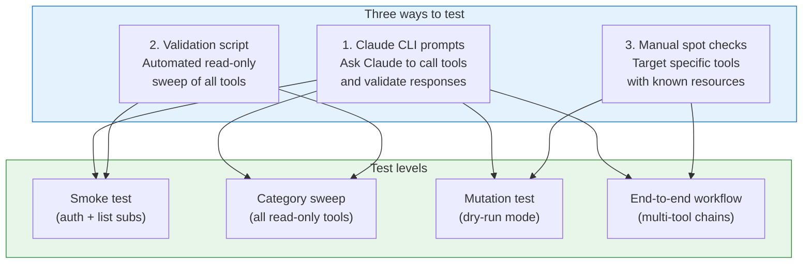

# Testing Guide

This guide helps Claude users verify that every Azure Observer MCP tool is functioning correctly. It covers prerequisites, a quick smoke test, detailed test cases for all 43 tools, and troubleshooting.

## Testing Architecture



---

## Prerequisites

Before running any tests, ensure:

- [ ] Node.js >= 20 is installed (`node --version`)
- [ ] The MCP server is built (`npm run build`)
- [ ] Azure CLI is logged in (`az login`) or service principal env vars are set
- [ ] You have at least **Reader** access on one Azure subscription
- [ ] (Optional) Set `AZURE_DRY_RUN=true` for safe mutation testing

### Quick env check

```bash
az account show --query "{name:name, id:id, state:state}" -o table
```

---

## 1. Smoke Test

The fastest way to verify the MCP server is working. Ask Claude:

> **Prompt**: "Use `azure/identity/whoami` to show my Azure identity, then use `azure/subscriptions/list` to list my subscriptions."

### Expected result

| Check | Expected |
|-------|----------|
| `whoami` returns | `authenticated: true`, tenant ID, UPN or object ID |
| `subscriptions/list` returns | At least 1 subscription with `state: "Enabled"` |

If either fails, see [Troubleshooting](#troubleshooting) below.

---

## 2. Automated Validation Script

A shell script is provided at `tests/validate-tools.sh` that sweeps all read-only tools using the MCP SDK inspector. See [Running the validation script](#running-the-validation-script) for details.

---

## 3. Test Cases — All Tools

> **Notation**: `$SUB` = your subscription ID, `$RG` = a resource group name you have access to.
> Fill these in with your actual values when testing.

### Foundation (6 tools)

#### TC-001: `azure/subscriptions/list`

| Field | Value |
|-------|-------|
| **Prompt** | "List all my Azure subscriptions" |
| **Parameters** | None |
| **Pass criteria** | Returns `count >= 1`, each subscription has `subscriptionId`, `displayName`, `state` |
| **RBAC** | Reader on any scope |

#### TC-002: `azure/resource-groups/list`

| Field | Value |
|-------|-------|
| **Prompt** | "List resource groups in subscription `$SUB`" |
| **Parameters** | `subscriptionId` |
| **Pass criteria** | Returns array of resource groups with `name`, `location`, `provisioningState` |

#### TC-003: `azure/resource-groups/create` (mutation — use dry-run)

| Field | Value |
|-------|-------|
| **Prompt** | "Create a resource group called 'mcp-test-rg' in eastus in subscription `$SUB`" |
| **Parameters** | `subscriptionId`, `name`, `location` |
| **Pass criteria (dry-run=true)** | Returns `DRY RUN` message with the planned parameters |
| **Pass criteria (dry-run=false)** | Returns created resource group with `provisioningState: Succeeded` |
| **Cleanup** | Delete the resource group after testing |

#### TC-004: `azure/resource-groups/delete` (mutation — use dry-run)

| Field | Value |
|-------|-------|
| **Prompt** | "Delete the 'mcp-test-rg' resource group in subscription `$SUB`" |
| **Parameters** | `subscriptionId`, `name` |
| **Pass criteria (dry-run=true)** | Returns `DRY RUN` message |
| **Pass criteria (dry-run=false)** | Returns `deleted: true` |

#### TC-005: `azure/resources/list`

| Field | Value |
|-------|-------|
| **Prompt** | "List all resources in resource group `$RG` in subscription `$SUB`" |
| **Parameters** | `subscriptionId`, `resourceGroupName` |
| **Pass criteria** | Returns array with `name`, `type`, `location` per resource |

#### TC-006: `azure/resources/get`

| Field | Value |
|-------|-------|
| **Prompt** | "Get details for resource `$RESOURCE_ID` in subscription `$SUB`" |
| **Parameters** | `subscriptionId`, `resourceId` (full ARM resource ID) |
| **Pass criteria** | Returns resource properties including `provisioningState` |

---

### Compute (5 tools)

#### TC-007: `azure/compute/vm/list`

| Field | Value |
|-------|-------|
| **Prompt** | "List all VMs in resource group `$RG`" |
| **Parameters** | `subscriptionId`, `resourceGroupName` |
| **Pass criteria** | Returns array (may be empty). Each VM has `name`, `location`, `vmSize`, `provisioningState` |

#### TC-008: `azure/compute/vm/get`

| Field | Value |
|-------|-------|
| **Prompt** | "Get details for VM `$VM_NAME` in `$RG`" |
| **Parameters** | `subscriptionId`, `resourceGroupName`, `vmName` |
| **Pass criteria** | Returns `powerState`, `osType`, `vmSize`, `adminUsername` |
| **Skip if** | No VMs exist |

#### TC-009: `azure/compute/vm/start` (mutation — use dry-run)

| Field | Value |
|-------|-------|
| **Prompt** | "Start VM `$VM_NAME` in `$RG`" |
| **Pass criteria (dry-run)** | Returns `DRY RUN` message |

#### TC-010: `azure/compute/vm/stop` (mutation — use dry-run)

| Field | Value |
|-------|-------|
| **Prompt** | "Stop VM `$VM_NAME` in `$RG`" |
| **Pass criteria (dry-run)** | Returns `DRY RUN` message |

#### TC-011: `azure/compute/vm/delete` (mutation — use dry-run)

| Field | Value |
|-------|-------|
| **Prompt** | "Delete VM `$VM_NAME` in `$RG`" |
| **Pass criteria (dry-run)** | Returns `DRY RUN` message |

---

### Storage (3 tools)

#### TC-012: `azure/storage/account/list`

| Field | Value |
|-------|-------|
| **Prompt** | "List storage accounts in `$RG`" |
| **Parameters** | `subscriptionId`, `resourceGroupName` |
| **Pass criteria** | Returns array. Each account has `name`, `location`, `kind`, `sku` |

#### TC-013: `azure/storage/account/get`

| Field | Value |
|-------|-------|
| **Prompt** | "Get details for storage account `$ACCOUNT_NAME` in `$RG`" |
| **Pass criteria** | Returns `accessTier`, `httpsOnly`, `provisioningState` |
| **Skip if** | No storage accounts exist |

#### TC-014: `azure/storage/account/create` (mutation — use dry-run)

| Field | Value |
|-------|-------|
| **Prompt** | "Create a storage account called 'mcptest2026' in eastus in `$RG`" |
| **Pass criteria (dry-run)** | Returns `DRY RUN` message |

---

### Identity & Monitoring (4 tools)

#### TC-015: `azure/identity/whoami`

| Field | Value |
|-------|-------|
| **Prompt** | "Who am I authenticated as in Azure?" |
| **Parameters** | None |
| **Pass criteria** | Returns `authenticated: true` with `tenantId` |

#### TC-016: `azure/monitor/activity-log`

| Field | Value |
|-------|-------|
| **Prompt** | "Show activity log for the last 1 day in subscription `$SUB`" |
| **Parameters** | `subscriptionId`, `daysBack: 1` |
| **Pass criteria** | Returns array of events (may be empty). Each has `operationName`, `status`, `caller` |

#### TC-017: `azure/deployments/list`

| Field | Value |
|-------|-------|
| **Prompt** | "List deployments in `$RG`" |
| **Parameters** | `subscriptionId`, `resourceGroupName` |
| **Pass criteria** | Returns array (may be empty). Each has `name`, `provisioningState`, `timestamp` |

#### TC-018: `azure/deployments/get`

| Field | Value |
|-------|-------|
| **Prompt** | "Get details for deployment `$DEPLOY_NAME` in `$RG`" |
| **Parameters** | `subscriptionId`, `resourceGroupName`, `deploymentName` |
| **Pass criteria** | Returns `provisioningState`, `correlationId` |
| **Skip if** | No deployments exist |

---

### Billing & Optimization (2 tools)

#### TC-019: `azure/billing/cost-report`

| Field | Value |
|-------|-------|
| **Prompt** | "Show month-to-date cost by service for subscription `$SUB`" |
| **Parameters** | `subscriptionId` |
| **Pass criteria** | Returns `rows` array with cost data OR a clear permission error |
| **RBAC** | Cost Management Reader |
| **Note** | Will return 403 if user lacks cost management permissions — this is expected and counts as a valid response |

#### TC-020: `azure/advisor/recommendations/list`

| Field | Value |
|-------|-------|
| **Prompt** | "List top 10 Advisor recommendations for subscription `$SUB`" |
| **Parameters** | `subscriptionId`, `maxItems: 10` |
| **Pass criteria** | Returns array (may be empty). Each has `category`, `impact`, `shortDescription` |

---

### Security (2 tools)

#### TC-021: `azure/security/defender/alerts/list`

| Field | Value |
|-------|-------|
| **Prompt** | "List Defender for Cloud alerts for subscription `$SUB`" |
| **Parameters** | `subscriptionId` |
| **Pass criteria** | Returns array (may be empty). Each has `alertDisplayName`, `severity` |
| **RBAC** | Security Reader |

#### TC-022: `azure/security/defender/assessments/list`

| Field | Value |
|-------|-------|
| **Prompt** | "List security assessments for subscription `$SUB`" |
| **Parameters** | `subscriptionId` |
| **Pass criteria** | Returns array (may be empty). Each has `displayName`, `statusCode` |

---

### App Service (3 tools)

#### TC-023: `azure/appservice/sites/list`

| Field | Value |
|-------|-------|
| **Prompt** | "List all web apps and function apps in subscription `$SUB`" |
| **Parameters** | `subscriptionId` |
| **Pass criteria** | Returns array (may be empty). Each has `name`, `defaultHostName`, `state` |

#### TC-024: `azure/appservice/plans/list`

| Field | Value |
|-------|-------|
| **Prompt** | "List App Service Plans in subscription `$SUB`" |
| **Parameters** | `subscriptionId` |
| **Pass criteria** | Returns array (may be empty). Each has `name`, `sku`, `numberOfSites` |

#### TC-025: `azure/appservice/site/get`

| Field | Value |
|-------|-------|
| **Prompt** | "Get details for web app `$SITE_NAME` in `$RG`" |
| **Parameters** | `subscriptionId`, `resourceGroupName`, `siteName` |
| **Pass criteria** | Returns `defaultHostName`, `httpsOnly`, `state` |
| **Skip if** | No web apps exist |

---

### Data (3 tools)

#### TC-026: `azure/sql/servers/list`

| Field | Value |
|-------|-------|
| **Prompt** | "List SQL servers in subscription `$SUB`" |
| **Parameters** | `subscriptionId` |
| **Pass criteria** | Returns array (may be empty). Each has `name`, `fullyQualifiedDomainName` |

#### TC-027: `azure/sql/databases/list`

| Field | Value |
|-------|-------|
| **Prompt** | "List databases on SQL server `$SERVER_NAME` in `$RG`" |
| **Parameters** | `subscriptionId`, `resourceGroupName`, `serverName` |
| **Pass criteria** | Returns array excluding system databases |
| **Skip if** | No SQL servers exist |

#### TC-028: `azure/cosmos/accounts/list`

| Field | Value |
|-------|-------|
| **Prompt** | "List Cosmos DB accounts in subscription `$SUB`" |
| **Parameters** | `subscriptionId` |
| **Pass criteria** | Returns array (may be empty). Each has `name`, `documentEndpoint` |

---

### Integration (2 tools)

#### TC-029: `azure/apim/services/list`

| Field | Value |
|-------|-------|
| **Prompt** | "List API Management services in subscription `$SUB`" |
| **Parameters** | `subscriptionId` |
| **Pass criteria** | Returns array (may be empty). Each has `name`, `gatewayUrl` |

#### TC-030: `azure/keyvault/vaults/list`

| Field | Value |
|-------|-------|
| **Prompt** | "List Key Vaults in subscription `$SUB`" |
| **Parameters** | `subscriptionId` |
| **Pass criteria** | Returns array (may be empty). Each has `name`, `vaultUri`, `sku` |

---

### Networking (4 tools)

#### TC-031: `azure/network/vnet/list`

| Field | Value |
|-------|-------|
| **Prompt** | "List all virtual networks in subscription `$SUB`" |
| **Parameters** | `subscriptionId` |
| **Pass criteria** | Returns array (may be empty). Each has `name`, `addressSpace`, `subnets` |

#### TC-032: `azure/network/nsg/list`

| Field | Value |
|-------|-------|
| **Prompt** | "List all NSGs in subscription `$SUB`" |
| **Parameters** | `subscriptionId` |
| **Pass criteria** | Returns array (may be empty). Each has `name`, `rulesCount` |

#### TC-033: `azure/network/nsg/rules`

| Field | Value |
|-------|-------|
| **Prompt** | "Show security rules for NSG `$NSG_NAME` in `$RG`" |
| **Parameters** | `subscriptionId`, `resourceGroupName`, `nsgName` |
| **Pass criteria** | Returns `rules` array with `name`, `priority`, `direction`, `access`, `protocol` |
| **Skip if** | No NSGs exist |

#### TC-034: `azure/network/publicip/list`

| Field | Value |
|-------|-------|
| **Prompt** | "List public IP addresses in subscription `$SUB`" |
| **Parameters** | `subscriptionId` |
| **Pass criteria** | Returns array (may be empty). Each has `name`, `ipAddress`, `allocationMethod` |

---

### Containers (4 tools)

#### TC-035: `azure/containers/aks/list`

| Field | Value |
|-------|-------|
| **Prompt** | "List AKS clusters in subscription `$SUB`" |
| **Parameters** | `subscriptionId` |
| **Pass criteria** | Returns array (may be empty). Each has `name`, `kubernetesVersion`, `provisioningState` |

#### TC-036: `azure/containers/aks/get`

| Field | Value |
|-------|-------|
| **Prompt** | "Get details for AKS cluster `$CLUSTER_NAME` in `$RG`" |
| **Parameters** | `subscriptionId`, `resourceGroupName`, `clusterName` |
| **Pass criteria** | Returns `kubernetesVersion`, `fqdn`, `nodePools` array |
| **Skip if** | No AKS clusters exist |

#### TC-037: `azure/containers/acr/list`

| Field | Value |
|-------|-------|
| **Prompt** | "List container registries in subscription `$SUB`" |
| **Parameters** | `subscriptionId` |
| **Pass criteria** | Returns array (may be empty). Each has `name`, `loginServer`, `sku` |

#### TC-038: `azure/containers/acr/get`

| Field | Value |
|-------|-------|
| **Prompt** | "Get details for ACR `$REGISTRY_NAME` in `$RG`" |
| **Parameters** | `subscriptionId`, `resourceGroupName`, `registryName` |
| **Pass criteria** | Returns `loginServer`, `sku`, `adminEnabled`, `provisioningState` |
| **Skip if** | No ACRs exist |

---

### Observability (2 tools)

#### TC-039: `azure/logs/workspace/list`

| Field | Value |
|-------|-------|
| **Prompt** | "List Log Analytics workspaces in subscription `$SUB`" |
| **Parameters** | `subscriptionId` |
| **Pass criteria** | Returns array (may be empty). Each has `name`, `customerId`, `retentionInDays` |

#### TC-040: `azure/logs/query`

| Field | Value |
|-------|-------|
| **Prompt** | "Run this KQL query against workspace `$WORKSPACE_ID`: `AzureActivity \| take 5`" |
| **Parameters** | `workspaceId` (customerId GUID), `kqlQuery`, `timeSpan: "P1D"` |
| **Pass criteria** | Returns `status: "Success"`, `tables` array with columns and rows |
| **RBAC** | Log Analytics Reader on the workspace |
| **Skip if** | No Log Analytics workspaces exist |

---

### DNS (2 tools)

#### TC-041: `azure/dns/zone/list`

| Field | Value |
|-------|-------|
| **Prompt** | "List DNS zones in subscription `$SUB`" |
| **Parameters** | `subscriptionId` |
| **Pass criteria** | Returns array (may be empty). Each has `name`, `numberOfRecordSets` |

#### TC-042: `azure/dns/recordset/list`

| Field | Value |
|-------|-------|
| **Prompt** | "List DNS records for zone `$ZONE_NAME` in `$RG`" |
| **Parameters** | `subscriptionId`, `resourceGroupName`, `zoneName` |
| **Pass criteria** | Returns array with `name`, `type`, `ttl`, `records` |
| **Skip if** | No DNS zones exist |

---

### Composite (1 tool)

#### TC-043: `azure/lifecycle/devops-report`

| Field | Value |
|-------|-------|
| **Prompt** | "Run a full DevOps lifecycle report for subscription `$SUB`" |
| **Parameters** | `subscriptionId` |
| **Pass criteria** | Returns object with sections: `cost` (or error), `advisor`, `security`, `claudeGuidance` |
| **Note** | Sections that fail due to permissions return graceful error messages, not exceptions |

---

## 4. Multi-Tool Workflow Tests

These test real-world scenarios by chaining multiple tools.

### WT-001: Environment Discovery Workflow

> "List my subscriptions. For the first one, list all resource groups. For the first resource group, list all resources. Summarize what you find."

**Pass criteria**: Claude successfully chains `subscriptions/list` → `resource-groups/list` → `resources/list` and produces a summary.

### WT-002: Network Security Audit Workflow

> "For subscription `$SUB`, list all VNets and NSGs. Then show me the rules for each NSG. Flag any rules that allow inbound traffic from the internet (source `*`) to ports 22, 3389, or 3306."

**Pass criteria**: Claude chains `vnet/list` → `nsg/list` → `nsg/rules` and produces security findings.

### WT-003: Container Platform Review Workflow

> "List my AKS clusters and container registries in subscription `$SUB`. Get details for any AKS cluster you find. Then list the Log Analytics workspaces — if one exists, run a KQL query for `KubePodInventory | summarize restarts=sum(PodRestartCount) by Name | top 10 by restarts`."

**Pass criteria**: Claude chains `aks/list` → `aks/get` → `acr/list` → `logs/workspace/list` → `logs/query` and reports cluster health.

### WT-004: Cost and Security Snapshot Workflow

> "Run the lifecycle DevOps report for subscription `$SUB`. Then drill into the top cost driver and top security issue."

**Pass criteria**: Claude calls `lifecycle/devops-report`, then uses `billing/cost-report` or `defender/alerts/list` for drill-down.

### WT-005: Mutation Safety Workflow (with dry-run)

> "With dry-run enabled, try to create a resource group 'test-safety-rg' in eastus. Then try to create a storage account 'testsafetystore' in it. Confirm no resources were actually created."

**Pass criteria**: Both operations return `DRY RUN` messages. A follow-up `resource-groups/list` confirms the RG was NOT created.

---

## 5. Running the Validation Script

An automated script tests all read-only tools against your live Azure subscription.

```bash
# Make executable
chmod +x tests/validate-tools.sh

# Run (requires az login + node + built project)
./tests/validate-tools.sh
```

The script:
1. Verifies prerequisites (Node.js, az login, built project)
2. Discovers your subscription ID automatically
3. Calls every read-only tool via JSON-RPC over stdio
4. Reports PASS / FAIL / SKIP for each tool
5. Generates a summary report

See `tests/validate-tools.sh` for implementation details.

---

## 6. Claude CLI Test Prompts — Copy-Paste Ready

Open Claude CLI and paste these prompts one by one for a full validation:

### Level 1 — Smoke Test

```
Use azure/identity/whoami and azure/subscriptions/list. Tell me if both work.
```

### Level 2 — Read-Only Sweep

```
Run a systematic test of all read-only Azure Observer tools for my first subscription.
For each tool, call it with minimal parameters and report:
- Tool name
- Result: OK (returned data), EMPTY (returned empty array — expected if no resources), or ERROR (with error message)

Test these tools in order:
1. azure/subscriptions/list
2. azure/resource-groups/list
3. azure/resources/list (use first RG)
4. azure/identity/whoami
5. azure/monitor/activity-log
6. azure/deployments/list (use first RG)
7. azure/compute/vm/list (use first RG)
8. azure/storage/account/list (use first RG)
9. azure/billing/cost-report
10. azure/advisor/recommendations/list
11. azure/security/defender/alerts/list
12. azure/security/defender/assessments/list
13. azure/appservice/sites/list
14. azure/appservice/plans/list
15. azure/sql/servers/list
16. azure/cosmos/accounts/list
17. azure/apim/services/list
18. azure/keyvault/vaults/list
19. azure/network/vnet/list
20. azure/network/nsg/list
21. azure/network/publicip/list
22. azure/containers/aks/list
23. azure/containers/acr/list
24. azure/logs/workspace/list
25. azure/dns/zone/list
26. azure/lifecycle/devops-report

Give me a final summary table with the results.
```

### Level 3 — Mutation Safety Test

```
Enable dry-run awareness: I have AZURE_DRY_RUN=true set.
Try these mutations and confirm all return DRY RUN messages:
1. Create resource group 'mcp-test-deleteme' in eastus
2. Create storage account 'mcptestdel2026' in that RG
3. Delete the resource group

After each, confirm it says DRY RUN and nothing was actually created.
```

---

## Troubleshooting

### Common Issues

| Symptom | Cause | Fix |
|---------|-------|-----|
| `whoami` returns `authenticated: false` | Azure CLI not logged in | Run `az login` |
| `subscriptions/list` returns empty | No subscriptions or allow-list misconfigured | Check `az account list` and `AZURE_ALLOWED_SUBSCRIPTIONS` |
| `cost-report` returns 403 | Missing Cost Management Reader role | `az role assignment create --role "Cost Management Reader"` |
| `logs/query` returns 403 | Missing Log Analytics Reader role | Grant role on the workspace |
| `defender/alerts/list` returns 403 | Missing Security Reader role | `az role assignment create --role "Security Reader"` |
| Tool returns "SUBSCRIPTION_NOT_ALLOWED" | Subscription not in allow-list | Add to `AZURE_ALLOWED_SUBSCRIPTIONS` or remove the env var |
| All mutations fail with DRY RUN | `AZURE_DRY_RUN=true` is set | Set to `false` if you want real mutations |
| MCP server won't start | Build not run or path wrong | Run `npm run build`, verify path in claude config |

### Verifying Azure permissions

```bash
# Check your current roles
az role assignment list --assignee "$(az ad signed-in-user show --query id -o tsv)" \
  --query "[].{role:roleDefinitionName, scope:scope}" -o table

# Check specific subscription access
az account show -s "$SUB_ID" --query "{name:name, state:state}" -o table
```

### Debug logging

Set `LOG_LEVEL=debug` in your MCP server environment to see detailed request/response logs on stderr.

---

## Test Result Template

Use this template to record your test results:

| Test ID | Tool | Result | Notes |
|---------|------|--------|-------|
| TC-001 | `subscriptions/list` | PASS / FAIL / SKIP | |
| TC-002 | `resource-groups/list` | PASS / FAIL / SKIP | |
| TC-003 | `resource-groups/create` | PASS / FAIL / SKIP | |
| TC-004 | `resource-groups/delete` | PASS / FAIL / SKIP | |
| TC-005 | `resources/list` | PASS / FAIL / SKIP | |
| TC-006 | `resources/get` | PASS / FAIL / SKIP | |
| TC-007 | `compute/vm/list` | PASS / FAIL / SKIP | |
| TC-008 | `compute/vm/get` | PASS / FAIL / SKIP | |
| TC-009 | `compute/vm/start` | PASS / FAIL / SKIP | |
| TC-010 | `compute/vm/stop` | PASS / FAIL / SKIP | |
| TC-011 | `compute/vm/delete` | PASS / FAIL / SKIP | |
| TC-012 | `storage/account/list` | PASS / FAIL / SKIP | |
| TC-013 | `storage/account/get` | PASS / FAIL / SKIP | |
| TC-014 | `storage/account/create` | PASS / FAIL / SKIP | |
| TC-015 | `identity/whoami` | PASS / FAIL / SKIP | |
| TC-016 | `monitor/activity-log` | PASS / FAIL / SKIP | |
| TC-017 | `deployments/list` | PASS / FAIL / SKIP | |
| TC-018 | `deployments/get` | PASS / FAIL / SKIP | |
| TC-019 | `billing/cost-report` | PASS / FAIL / SKIP | |
| TC-020 | `advisor/recommendations` | PASS / FAIL / SKIP | |
| TC-021 | `defender/alerts` | PASS / FAIL / SKIP | |
| TC-022 | `defender/assessments` | PASS / FAIL / SKIP | |
| TC-023 | `appservice/sites/list` | PASS / FAIL / SKIP | |
| TC-024 | `appservice/plans/list` | PASS / FAIL / SKIP | |
| TC-025 | `appservice/site/get` | PASS / FAIL / SKIP | |
| TC-026 | `sql/servers/list` | PASS / FAIL / SKIP | |
| TC-027 | `sql/databases/list` | PASS / FAIL / SKIP | |
| TC-028 | `cosmos/accounts/list` | PASS / FAIL / SKIP | |
| TC-029 | `apim/services/list` | PASS / FAIL / SKIP | |
| TC-030 | `keyvault/vaults/list` | PASS / FAIL / SKIP | |
| TC-031 | `network/vnet/list` | PASS / FAIL / SKIP | |
| TC-032 | `network/nsg/list` | PASS / FAIL / SKIP | |
| TC-033 | `network/nsg/rules` | PASS / FAIL / SKIP | |
| TC-034 | `network/publicip/list` | PASS / FAIL / SKIP | |
| TC-035 | `containers/aks/list` | PASS / FAIL / SKIP | |
| TC-036 | `containers/aks/get` | PASS / FAIL / SKIP | |
| TC-037 | `containers/acr/list` | PASS / FAIL / SKIP | |
| TC-038 | `containers/acr/get` | PASS / FAIL / SKIP | |
| TC-039 | `logs/workspace/list` | PASS / FAIL / SKIP | |
| TC-040 | `logs/query` | PASS / FAIL / SKIP | |
| TC-041 | `dns/zone/list` | PASS / FAIL / SKIP | |
| TC-042 | `dns/recordset/list` | PASS / FAIL / SKIP | |
| TC-043 | `lifecycle/devops-report` | PASS / FAIL / SKIP | |
