# Tools Reference

Complete reference for all tools provided by the Azure Observer MCP Server.

## Tool Overview

```mermaid
graph TD
    subgraph Foundation["Foundation"]
        SL["subscriptions/list"]
        RGL["resource-groups/*"]
        RL["resources/*"]
    end

    subgraph Compute["Compute"]
        VM["compute/vm/*"]
    end

    subgraph Storage["Storage"]
        ST["storage/account/*"]
    end

    subgraph Observe["Identity & Monitoring"]
        WHO["identity/whoami"]
        ACT["monitor/activity-log"]
        DEP["deployments/*"]
    end

    subgraph CostSec["Cost & Security"]
        BILL["billing/cost-report"]
        ADV["advisor/recommendations/list"]
        DEFA["security/defender/alerts"]
        DEFS["security/defender/assessments"]
    end

    subgraph DevStack["App / API / Data"]
        APP["appservice/sites|plans|site"]
        SQL["sql/servers|databases"]
        APIM["apim/services"]
        COS["cosmos/accounts"]
        KV["keyvault/vaults"]
    end

    subgraph Network["Networking"]
        VNET["network/vnet/list"]
        NSG["network/nsg/list|rules"]
        PIP["network/publicip/list"]
    end

    subgraph Containers["Containers"]
        AKS["containers/aks/list|get"]
        ACR["containers/acr/list|get"]
    end

    subgraph Logs["Observability"]
        LAW["logs/workspace/list"]
        KQL["logs/query"]
    end

    subgraph DNS["DNS"]
        ZN["dns/zone/list"]
        RS["dns/recordset/list"]
    end

    subgraph Lifecycle["Lifecycle"]
        LIF["lifecycle/devops-report"]
    end

    style Foundation fill:#e3f2fd,stroke:#1976D2
    style Compute fill:#fff3e0,stroke:#F57C00
    style Storage fill:#e8f5e9,stroke:#388E3C
    style Observe fill:#f3e5f5,stroke:#7B1FA2
    style CostSec fill:#fff8e1,stroke:#F9A825
    style DevStack fill:#e0f7fa,stroke:#00838F
    style Network fill:#fbe9e7,stroke:#BF360C
    style Containers fill:#e8eaf6,stroke:#283593
    style Logs fill:#f1f8e9,stroke:#33691E
    style DNS fill:#fff9c4,stroke:#F57F17
    style Lifecycle fill:#fce4ec,stroke:#AD1457
```



---

## Foundation Tools

### `azure/subscriptions/list`

List all accessible Azure subscriptions.

- **Mutating**: No
- **Parameters**: None
- **Returns**: Array of subscriptions with ID, display name, and state

**Example prompt**: "List all my Azure subscriptions"

**Example response**:

```json
{
  "count": 2,
  "subscriptions": [
    {
      "id": "/subscriptions/aaaa-bbbb-cccc",
      "subscriptionId": "aaaa-bbbb-cccc",
      "displayName": "Production",
      "state": "Enabled"
    },
    {
      "id": "/subscriptions/dddd-eeee-ffff",
      "subscriptionId": "dddd-eeee-ffff",
      "displayName": "Development",
      "state": "Enabled"
    }
  ]
}
```

---

### `azure/resource-groups/list`

List all resource groups in a subscription.

- **Mutating**: No
- **Parameters**:

| Parameter | Type | Required | Description |
|-----------|------|----------|-------------|
| `subscriptionId` | string | Yes | Azure subscription ID |

**Example prompt**: "Show me all resource groups in my production subscription"

---

### `azure/resource-groups/create`

Create a new resource group.

- **Mutating**: Yes (respects dry-run)
- **Parameters**:

| Parameter | Type | Required | Description |
|-----------|------|----------|-------------|
| `subscriptionId` | string | Yes | Azure subscription ID |
| `name` | string | Yes | Resource group name |
| `location` | string | Yes | Azure region (e.g. `eastus`, `westeurope`) |
| `tags` | object | No | Key-value tags |

**Example prompt**: "Create a resource group called 'my-app-rg' in East US"

---

### `azure/resource-groups/delete`

Delete a resource group and **all resources within it**.

- **Mutating**: Yes (destructive, respects dry-run)
- **Parameters**:

| Parameter | Type | Required | Description |
|-----------|------|----------|-------------|
| `subscriptionId` | string | Yes | Azure subscription ID |
| `name` | string | Yes | Resource group name |

**Example prompt**: "Delete the 'test-rg' resource group"

> **Warning**: This permanently deletes the resource group and every resource inside it. This action is irreversible.

---

### `azure/resources/list`

List all resources within a resource group.

- **Mutating**: No
- **Parameters**:

| Parameter | Type | Required | Description |
|-----------|------|----------|-------------|
| `subscriptionId` | string | Yes | Azure subscription ID |
| `resourceGroupName` | string | Yes | Resource group name |

**Example prompt**: "What resources exist in the 'production-rg' resource group?"

---

### `azure/resources/get`

Get detailed information about a specific resource by its full Azure resource ID.

- **Mutating**: No
- **Parameters**:

| Parameter | Type | Required | Description |
|-----------|------|----------|-------------|
| `subscriptionId` | string | Yes | Azure subscription ID |
| `resourceId` | string | Yes | Full Azure resource ID |

**Example prompt**: "Get details for resource /subscriptions/.../resourceGroups/.../providers/..."

---

## Compute Tools

### `azure/compute/vm/list`

List all virtual machines in a resource group.

- **Mutating**: No
- **Parameters**:

| Parameter | Type | Required | Description |
|-----------|------|----------|-------------|
| `subscriptionId` | string | Yes | Azure subscription ID |
| `resourceGroupName` | string | Yes | Resource group name |

**Example prompt**: "List all VMs in the 'infra-rg' resource group"

---

### `azure/compute/vm/get`

Get detailed information about a VM, including its power state.

- **Mutating**: No
- **Parameters**:

| Parameter | Type | Required | Description |
|-----------|------|----------|-------------|
| `subscriptionId` | string | Yes | Azure subscription ID |
| `resourceGroupName` | string | Yes | Resource group name |
| `vmName` | string | Yes | Virtual machine name |

**Example prompt**: "What's the status of the 'web-server' VM?"

**Example response**:

```json
{
  "name": "web-server",
  "location": "eastus",
  "vmSize": "Standard_B2s",
  "provisioningState": "Succeeded",
  "powerState": "VM running",
  "osType": "Linux",
  "adminUsername": "azureuser"
}
```

---

### `azure/compute/vm/start`

Start a stopped/deallocated VM.

- **Mutating**: Yes (respects dry-run)
- **Parameters**:

| Parameter | Type | Required | Description |
|-----------|------|----------|-------------|
| `subscriptionId` | string | Yes | Azure subscription ID |
| `resourceGroupName` | string | Yes | Resource group name |
| `vmName` | string | Yes | Virtual machine name |

**Example prompt**: "Start the 'web-server' VM"

---

### `azure/compute/vm/stop`

Stop and deallocate a running VM (stops compute billing).

- **Mutating**: Yes (respects dry-run)
- **Parameters**:

| Parameter | Type | Required | Description |
|-----------|------|----------|-------------|
| `subscriptionId` | string | Yes | Azure subscription ID |
| `resourceGroupName` | string | Yes | Resource group name |
| `vmName` | string | Yes | Virtual machine name |

**Example prompt**: "Stop the 'dev-server' VM to save costs"

---

### `azure/compute/vm/delete`

Permanently delete a virtual machine.

- **Mutating**: Yes (destructive, respects dry-run)
- **Parameters**:

| Parameter | Type | Required | Description |
|-----------|------|----------|-------------|
| `subscriptionId` | string | Yes | Azure subscription ID |
| `resourceGroupName` | string | Yes | Resource group name |
| `vmName` | string | Yes | Virtual machine name |

**Example prompt**: "Delete the 'old-test-vm' virtual machine"

> **Warning**: This permanently deletes the VM. Associated disks and NICs may remain.

---

## Storage Tools

### `azure/storage/account/list`

List storage accounts in a resource group.

- **Mutating**: No
- **Parameters**:

| Parameter | Type | Required | Description |
|-----------|------|----------|-------------|
| `subscriptionId` | string | Yes | Azure subscription ID |
| `resourceGroupName` | string | Yes | Resource group name |

**Example prompt**: "List storage accounts in the 'data-rg' resource group"

---

### `azure/storage/account/get`

Get detailed information about a storage account.

- **Mutating**: No
- **Parameters**:

| Parameter | Type | Required | Description |
|-----------|------|----------|-------------|
| `subscriptionId` | string | Yes | Azure subscription ID |
| `resourceGroupName` | string | Yes | Resource group name |
| `accountName` | string | Yes | Storage account name |

**Example prompt**: "Show me details for the 'myappstorage' storage account"

---

### `azure/storage/account/create`

Create a new storage account.

- **Mutating**: Yes (respects dry-run)
- **Parameters**:

| Parameter | Type | Required | Description |
|-----------|------|----------|-------------|
| `subscriptionId` | string | Yes | Azure subscription ID |
| `resourceGroupName` | string | Yes | Resource group name |
| `accountName` | string | Yes | Storage account name (3-24 chars, lowercase + numbers only) |
| `location` | string | Yes | Azure region |
| `sku` | string | No | SKU (default: `Standard_LRS`). Options: `Standard_LRS`, `Standard_GRS`, `Premium_LRS` |
| `kind` | string | No | Kind (default: `StorageV2`). Options: `StorageV2`, `BlobStorage`, `BlockBlobStorage` |

**Example prompt**: "Create a storage account called 'mydata2026' in West Europe with geo-redundant storage"

---

## Identity & Monitoring Tools

### `azure/identity/whoami`

Show the currently authenticated Azure identity and server configuration.

- **Mutating**: No
- **Parameters**: None

**Example prompt**: "Who am I authenticated as in Azure?"

**Example response**:

```json
{
  "authenticated": true,
  "tenantId": "xxxxxxxx-xxxx-xxxx-xxxx-xxxxxxxxxxxx",
  "upn": "user@example.com",
  "name": "John Doe",
  "dryRunEnabled": false,
  "allowedSubscriptions": "all"
}
```

---

### `azure/monitor/activity-log`

Query Azure Activity Log entries.

- **Mutating**: No
- **Parameters**:

| Parameter | Type | Required | Description |
|-----------|------|----------|-------------|
| `subscriptionId` | string | Yes | Azure subscription ID |
| `resourceGroupName` | string | No | Filter to a specific resource group |
| `daysBack` | number | No | Days to look back (1-90, default: 1) |
| `maxEvents` | number | No | Max events to return (1-200, default: 50) |

**Example prompt**: "Show me the last 7 days of activity in the 'production-rg' resource group"

---

### `azure/deployments/list`

List ARM deployments in a resource group.

- **Mutating**: No
- **Parameters**:

| Parameter | Type | Required | Description |
|-----------|------|----------|-------------|
| `subscriptionId` | string | Yes | Azure subscription ID |
| `resourceGroupName` | string | Yes | Resource group name |

**Example prompt**: "List all deployments in the 'infra-rg' resource group"

---

### `azure/deployments/get`

Get detailed status and outputs of a specific deployment.

- **Mutating**: No
- **Parameters**:

| Parameter | Type | Required | Description |
|-----------|------|----------|-------------|
| `subscriptionId` | string | Yes | Azure subscription ID |
| `resourceGroupName` | string | Yes | Resource group name |
| `deploymentName` | string | Yes | Deployment name |

**Example prompt**: "Show me the status and outputs of the 'webapp-deploy' deployment"

---

## Billing & cost (Cost Management)

### `azure/billing/cost-report`

Query **actual cost** aggregated by Azure dimension (requires Cost Management permissions, e.g. Cost Management Reader).

- **Mutating**: No
- **Parameters**:

| Parameter | Type | Required | Description |
|-----------|------|----------|-------------|
| `subscriptionId` | string | Yes | Azure subscription ID |
| `groupBy` | enum | No | `ServiceName` (default), `ResourceGroupName`, or `ResourceLocation` |
| `timeframe` | enum | No | `MonthToDate`, `TheLastMonth`, `WeekToDate`, or `Custom` |
| `from` / `to` | string | For Custom | ISO date range |
| `maxRows` | number | No | 1–100 (default 25) |

**Example prompt**: "Show month-to-date Azure cost broken down by service for subscription X"

---

## Azure Advisor

### `azure/advisor/recommendations/list`

List **Azure Advisor** recommendations (cost, security, reliability, performance, operational excellence).

- **Mutating**: No
- **Parameters**:

| Parameter | Type | Required | Description |
|-----------|------|----------|-------------|
| `subscriptionId` | string | Yes | Azure subscription ID |
| `category` | enum | No | `Cost`, `Security`, `Performance`, `OperationalExcellence`, `HighAvailability` |
| `maxItems` | number | No | 1–200 (default 50) |

**Example prompt**: "List top Security category Advisor recommendations for my subscription"

---

## Microsoft Defender for Cloud

### `azure/security/defender/alerts/list`

List **Defender for Cloud alerts** (threat detection).

- **Mutating**: No
- **Requires**: Security Reader or equivalent Defender access

| Parameter | Type | Description |
|-----------|------|-------------|
| `subscriptionId` | string | Subscription ID |
| `maxItems` | number | Max alerts (default 40) |

---

### `azure/security/defender/assessments/list`

List **security assessments** (posture) with per-resource status. Use unhealthy rows as a remediation backlog.

- **Mutating**: No

| Parameter | Type | Description |
|-----------|------|-------------|
| `subscriptionId` | string | Subscription ID |
| `maxItems` | number | Max assessments (default 100, cap 300) |

---

## App Service & Functions (build / deploy targets)

### `azure/appservice/sites/list`

List **web apps and function apps** (App Service resources).

| Parameter | Type | Description |
|-----------|------|-------------|
| `subscriptionId` | string | Required |
| `resourceGroupName` | string | Optional filter |

---

### `azure/appservice/plans/list`

List **App Service Plans** (hosting SKUs).

---

### `azure/appservice/site/get`

Get site metadata: default hostname, HTTPS-only, runtime stack hints, CORS allowed origins. **Does not** return app settings or connection strings.

---

## Azure SQL

### `azure/sql/servers/list`

List **SQL logical servers**.

### `azure/sql/databases/list`

List **user databases** on a server (system DBs excluded).

---

## API Management

### `azure/apim/services/list`

List **API Management** services with **gateway URL** (public API base for Claude-built APIs).

---

## Cosmos DB

### `azure/cosmos/accounts/list`

List **Cosmos DB accounts** with document endpoint.

---

## Key Vault (metadata only)

### `azure/keyvault/vaults/list`

List vaults: URI, SKU, RBAC authorization mode. **Never returns secret values.**

---

## Composite DevOps report

### `azure/lifecycle/devops-report`

Single call that aggregates:

- Month-to-date **cost by service** (if Cost API succeeds)
- **Advisor** recommendations (filterable by category)
- **Defender** alerts and a sample of **unhealthy** assessments
- Short **Claude guidance** bullets for prioritization

| Parameter | Type | Description |
|-----------|------|-------------|
| `subscriptionId` | string | Required |
| `includeCost` / `includeAdvisor` / `includeSecurity` | boolean | Toggle sections (default true) |
| `advisorMax` | number | Max advisor rows |
| `advisorCategories` | string[] | Optional filter |
| `securityAlertsMax` / `securityAssessmentsMax` | number | Limits |

**Example prompt**: "Run the Azure lifecycle DevOps report for my subscription and suggest a prioritized remediation plan"

---

## Networking Tools

### `azure/network/vnet/list`

List virtual networks — optionally scoped to a resource group, otherwise subscription-wide.

- **Mutating**: No
- **Parameters**:

| Parameter | Type | Required | Description |
|-----------|------|----------|-------------|
| `subscriptionId` | string | Yes | Azure subscription ID |
| `resourceGroupName` | string | No | Scope to a resource group (omit for all VNets) |

**Example prompt**: "List all virtual networks in my subscription"

**Example response**:

```json
{
  "count": 2,
  "virtualNetworks": [
    {
      "name": "prod-vnet",
      "location": "eastus",
      "addressSpace": ["10.0.0.0/16"],
      "subnets": [
        { "name": "default", "addressPrefix": "10.0.0.0/24" },
        { "name": "aks-subnet", "addressPrefix": "10.0.1.0/24" }
      ],
      "provisioningState": "Succeeded"
    }
  ]
}
```

---

### `azure/network/nsg/list`

List Network Security Groups — optionally scoped to a resource group.

- **Mutating**: No
- **Parameters**:

| Parameter | Type | Required | Description |
|-----------|------|----------|-------------|
| `subscriptionId` | string | Yes | Azure subscription ID |
| `resourceGroupName` | string | No | Scope to a resource group |

**Example prompt**: "Show all NSGs in the 'network-rg' resource group"

---

### `azure/network/nsg/rules`

Get the security rules for a specific Network Security Group. Useful for auditing open ports and allowed traffic.

- **Mutating**: No
- **Parameters**:

| Parameter | Type | Required | Description |
|-----------|------|----------|-------------|
| `subscriptionId` | string | Yes | Azure subscription ID |
| `resourceGroupName` | string | Yes | Resource group name |
| `nsgName` | string | Yes | Network Security Group name |

**Example prompt**: "Show me the security rules for the 'web-nsg' network security group — are any ports open to the internet?"

**Example response**:

```json
{
  "name": "web-nsg",
  "rules": [
    {
      "name": "Allow-HTTPS",
      "priority": 100,
      "direction": "Inbound",
      "access": "Allow",
      "protocol": "Tcp",
      "sourceAddressPrefix": "*",
      "destinationPortRange": "443"
    }
  ]
}
```

---

### `azure/network/publicip/list`

List public IP addresses — optionally scoped to a resource group.

- **Mutating**: No
- **Parameters**:

| Parameter | Type | Required | Description |
|-----------|------|----------|-------------|
| `subscriptionId` | string | Yes | Azure subscription ID |
| `resourceGroupName` | string | No | Scope to a resource group |

**Example prompt**: "List all public IPs in my subscription"

---

## Container Tools

### `azure/containers/aks/list`

List AKS (Azure Kubernetes Service) managed clusters — optionally scoped to a resource group.

- **Mutating**: No
- **Parameters**:

| Parameter | Type | Required | Description |
|-----------|------|----------|-------------|
| `subscriptionId` | string | Yes | Azure subscription ID |
| `resourceGroupName` | string | No | Scope to a resource group |

**Example prompt**: "List all Kubernetes clusters in my subscription"

---

### `azure/containers/aks/get`

Get detailed AKS cluster info including networking configuration, node pool details, and autoscaling settings.

- **Mutating**: No
- **Parameters**:

| Parameter | Type | Required | Description |
|-----------|------|----------|-------------|
| `subscriptionId` | string | Yes | Azure subscription ID |
| `resourceGroupName` | string | Yes | Resource group name |
| `clusterName` | string | Yes | AKS cluster name |

**Example prompt**: "Show me details about the 'prod-aks' cluster — what node pools and Kubernetes version is it running?"

**Example response**:

```json
{
  "name": "prod-aks",
  "kubernetesVersion": "1.29.2",
  "fqdn": "prod-aks-abc123.hcp.eastus.azmk8s.io",
  "networkPlugin": "azure",
  "nodePools": [
    {
      "name": "system",
      "vmSize": "Standard_D4s_v5",
      "count": 3,
      "enableAutoScaling": true,
      "minCount": 2,
      "maxCount": 5,
      "mode": "System"
    }
  ]
}
```

---

### `azure/containers/acr/list`

List Azure Container Registries — optionally scoped to a resource group.

- **Mutating**: No
- **Parameters**:

| Parameter | Type | Required | Description |
|-----------|------|----------|-------------|
| `subscriptionId` | string | Yes | Azure subscription ID |
| `resourceGroupName` | string | No | Scope to a resource group |

**Example prompt**: "List all container registries in my subscription"

---

### `azure/containers/acr/get`

Get detailed ACR registry info — SKU, login server, encryption status, public network access.

- **Mutating**: No
- **Parameters**:

| Parameter | Type | Required | Description |
|-----------|------|----------|-------------|
| `subscriptionId` | string | Yes | Azure subscription ID |
| `resourceGroupName` | string | Yes | Resource group name |
| `registryName` | string | Yes | Container registry name |

**Example prompt**: "Show me the details for the 'prodimages' container registry"

---

## Observability Tools (Log Analytics + KQL)

### `azure/logs/workspace/list`

List Log Analytics workspaces — optionally scoped to a resource group.

- **Mutating**: No
- **Parameters**:

| Parameter | Type | Required | Description |
|-----------|------|----------|-------------|
| `subscriptionId` | string | Yes | Azure subscription ID |
| `resourceGroupName` | string | No | Scope to a resource group |

**Example prompt**: "List all Log Analytics workspaces in my subscription"

---

### `azure/logs/query`

Run a KQL (Kusto Query Language) query against a Log Analytics workspace. Returns up to 200 rows. Extremely powerful for diagnostics, security investigations, and performance analysis.

- **Mutating**: No
- **Parameters**:

| Parameter | Type | Required | Description |
|-----------|------|----------|-------------|
| `workspaceId` | string | Yes | Log Analytics workspace ID (the GUID customerId, not the ARM resource ID) |
| `kqlQuery` | string | Yes | KQL query string |
| `timeSpan` | string | No | ISO 8601 duration — `P1D` (1 day, default), `PT1H` (1 hour), `P7D` (7 days) |

**Example prompt**: "Query the Log Analytics workspace for all Error-level Azure Activity events in the last 24 hours"

**Example KQL queries**:

```kql
// Recent errors in activity log
AzureActivity | where Level == "Error" | take 20

// Container insights — pod restart count
KubePodInventory | summarize restarts=sum(PodRestartCount) by Name | top 10 by restarts

// Application Insights — failed requests
requests | where success == false | summarize count() by name | top 10 by count_

// Sign-in failures
SigninLogs | where ResultType != "0" | summarize count() by UserPrincipalName, ResultDescription | top 20 by count_
```

---

## DNS Tools

### `azure/dns/zone/list`

List all Azure DNS zones in a subscription.

- **Mutating**: No
- **Parameters**:

| Parameter | Type | Required | Description |
|-----------|------|----------|-------------|
| `subscriptionId` | string | Yes | Azure subscription ID |

**Example prompt**: "List all DNS zones in my subscription"

---

### `azure/dns/recordset/list`

List DNS record sets for a zone — optionally filtered by record type.

- **Mutating**: No
- **Parameters**:

| Parameter | Type | Required | Description |
|-----------|------|----------|-------------|
| `subscriptionId` | string | Yes | Azure subscription ID |
| `resourceGroupName` | string | Yes | Resource group name |
| `zoneName` | string | Yes | DNS zone name (e.g. `contoso.com`) |
| `recordType` | string | No | Filter by type: `A`, `AAAA`, `CNAME`, `MX`, `NS`, `TXT`, `SRV` |

**Example prompt**: "Show me all A records for the contoso.com DNS zone"
