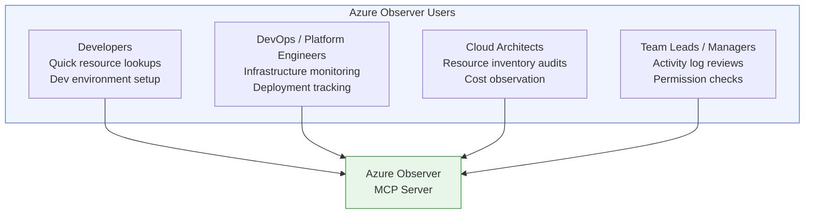
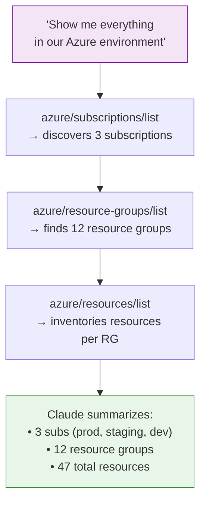
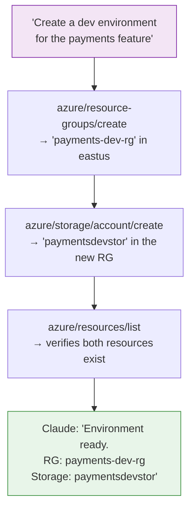
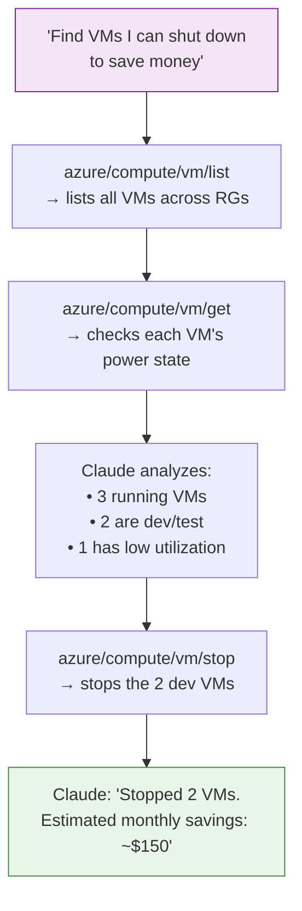
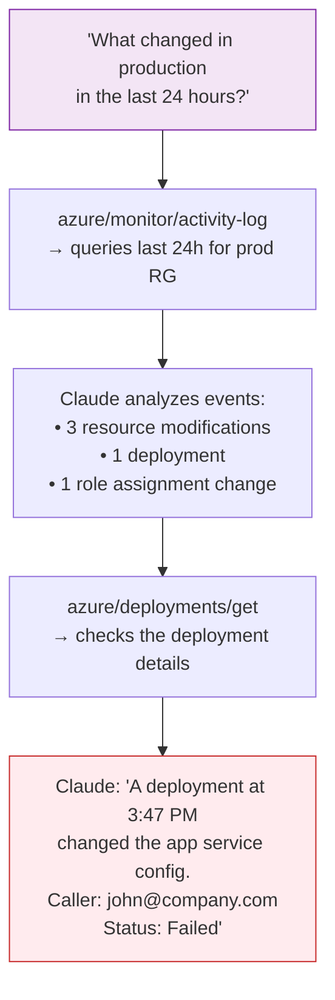
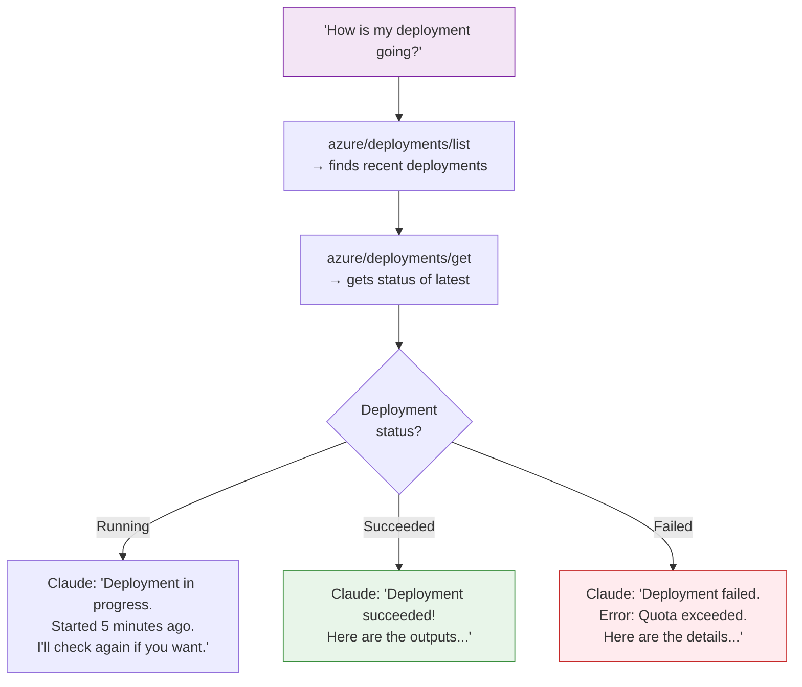
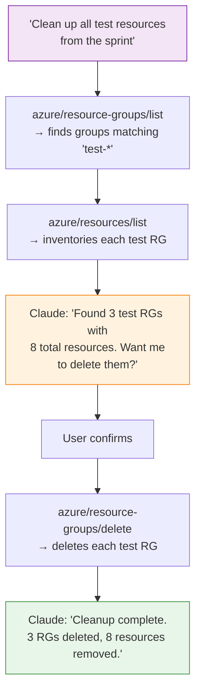
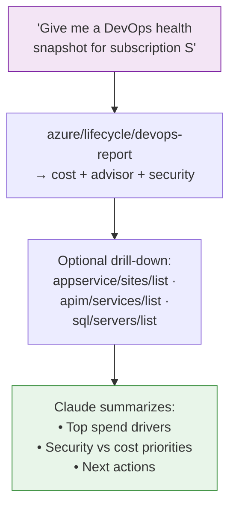

# Use Cases & Workflows

This guide demonstrates practical ways to use the Azure Observer MCP Server with Claude, from simple queries to complex multi-step workflows.

## Who Benefits

---

## Workflow 1: Environment Discovery

**Scenario**: You join a new team and need to understand what Azure resources exist.

**Try saying**:

> "List all my Azure subscriptions, then for each one show me the resource groups and what's in them. Give me a summary."

---

## Workflow 2: Development Environment Setup

**Scenario**: You need a new isolated environment for a feature branch.

**Try saying**:

> "Create a new resource group called 'payments-dev-rg' in East US, then create a storage account called 'paymentsdevstor' in it."

---

## Workflow 3: Cost Optimization — Find Idle VMs

**Scenario**: Monthly costs are rising. You want to find VMs that can be stopped.

**Try saying**:

> "List all VMs across my resource groups, check which ones are running, and tell me which dev/test VMs could be stopped to save costs."

---

## Workflow 4: Incident Investigation

**Scenario**: Something broke in production. You need to understand what changed.

**Try saying**:

> "Show me the activity log for the 'production-rg' resource group from the last 24 hours. I'm looking for any changes that might have caused issues."

---

## Workflow 5: Deployment Monitoring

**Scenario**: You kicked off a deployment and want to track its progress.

**Try saying**:

> "Check the status of the most recent deployment in 'infra-rg'. If it failed, tell me what went wrong."

---

## Workflow 6: Security Audit

**Scenario**: Before a compliance review, you need to verify who has access to what.

**Try saying**:

> "Show me my Azure identity and what subscriptions I have access to. Then list the activity log from the past 7 days — I want to see who made changes to the production resource group."

---

## Workflow 7: Environment Cleanup

**Scenario**: A sprint ended and you want to clean up temporary resources.

**Try saying**:

> "Find all resource groups with 'test' or 'temp' in their name. Show me what's in each one, then I'll tell you which ones to delete."

> **Tip**: Enable `AZURE_DRY_RUN=true` to preview deletions before executing.

---

## Workflow 8: DevOps snapshot for Claude-built apps (v0.2)

**Scenario**: You ship APIs and web apps on Azure and want **cost**, **Advisor**, and **Defender** context in one pass—ideal for **Claude Code / CLI** review meetings.

**Try saying**:

> "Run `azure/lifecycle/devops-report` for my subscription, then recommend a prioritized backlog for this sprint."

See [DevOps & lifecycle](./devops-lifecycle.md) for RBAC requirements and detailed flows.

---

## Quick Reference: Common Prompts

| What you want | What to ask Claude |
|---|---|
| See your identity | "Who am I logged in as in Azure?" |
| List subscriptions | "What Azure subscriptions do I have?" |
| Explore resources | "What resources are in the 'my-rg' resource group?" |
| Check VM status | "Is the 'web-server' VM running?" |
| Start/stop a VM | "Stop the 'dev-vm' to save costs" |
| Create infrastructure | "Create a resource group and storage account in West US" |
| Check activity | "What happened in production in the last 3 days?" |
| Track deployments | "Show me the status of the latest deployment" |
| Audit access | "Show me my permissions and recent activity" |
| Clean up | "Find and delete all test resource groups" |
| Cost & Advisor | "Show month-to-date cost by service and top Advisor recommendations" |
| Defender posture | "List unhealthy security assessments and related alerts" |
| App stack map | "List my API Management gateways and App Service hostnames for the API project" |
